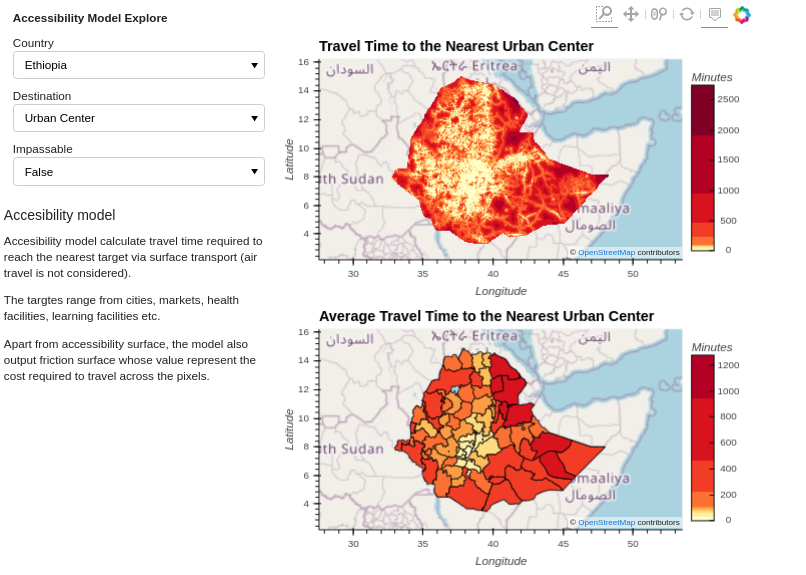
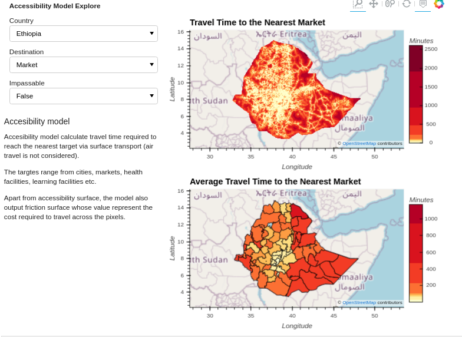
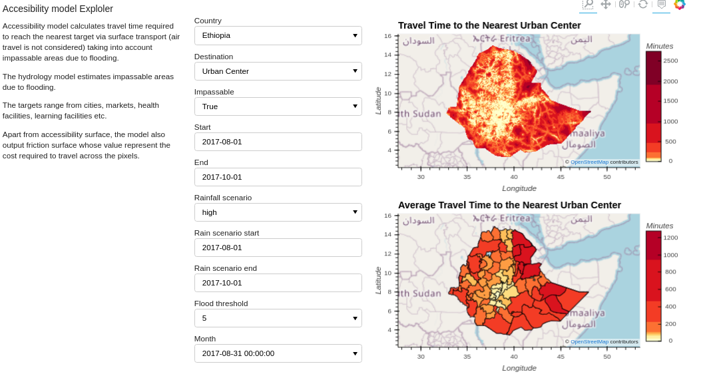

# Accessibility Model

The economic and man-made resources that sustain human wellbeing are not distributed 
evenly across the world, but are instead heavily concentrated in cities. 
Poor access to opportunities and services offered by urban centers 
(a function of distance, transport infrastructure, and the spatial distribution of cities) 
is a major barrier to improved livelihoods and overall development.
The model calculates travel time to cities via surface transport (air travel is not considered). 
The model output is used as input to the economic model and to inform the design 
and implementation of development policies. The accessibility model is also used to estimate travel 
time to markets, which is used to disaggregate market prices to a pixel level.

## Input datasets
The dataset used to compute travel time to the nearest urban areas as defined by GHS:
* Road networks from OSM, downloaded from [Geofabrik](http://download.geofabrik.de/)
* Railroads from OSM, downloaded from [Geofabrik](http://download.geofabrik.de/)
* River data from OSM, downloaded from [Geofabrik](http://download.geofabrik.de/)
* Land cover from [European Space Agency](http://due.esrin.esa.int/page_globcover.php) 
* Digital Elevation Model downloaded from [Hydroshed](https://hydrosheds.cr.usgs.gov/dataavail.php)
* Urban areas from [GHS Settlement Grid](https://ghsl.jrc.ec.europa.eu/ghs_smod.php)
* Flooded surface is the output of the task MonthlyRiverFloodingTiff in Hydrology model
* National borders from UN global administrative units layer (GAUL)

## Data Preprocessing
The script [data_pre](https://gitlab.com/kimetrica/darpa/darpa/-/blob/master/models/accessibility_model/data_pre.py) does the data preprocessing. 
Data preprocessing operations include:
* Masking and resampling the model inputs to ensure they have the same spatial extent and resolution. 
* Cleaning speed limit. Speed limits less or equal to zero were replaced by missing values. 
  Average speed limit specific to road class and country were used to fill the missing speed limit. 
* The vector dataset (road, railroads, rivers and national boundary) were converted to grids, 
  with the pixel values representing speed of movement.
* The model makes the assumption that it takes one hour to cross the national boundary. 

The vector dataset (road, railroads, rivers and national boundary) was converted to grids, with the pixel 
values representing speed of movement. It was assumed that it takes people one hour to a cross national boundary.
All the grids were aligned such that they have the same extent using geography from GlobalParameters and a spatial resolution of about 1 km.

## Building the model
The land-cover-dependant travel speeds were adjusted to take into account the effect of topographical properties. 
The adjustment applied to elevation accounts for decreasing atmospheric density with altitude which closely 
parallels the drop in maximal oxygen consumption and thus decreased the predicted travel speed as a
function of altutude.

Elevation  adjustment  factor = $`1.016e^{-0.0001072 \times elevation}`$

Steep terrain slows humans' ability to traverse it on foot. For the slope adjustment we used Tobler's Hiking Function.

Slope adjustment factor = Tobler's walking speed/5.0

Toblers's walking speed = $`6e^{-3.5|tan(0.01745 \times slope angle) + 0.05|}`$

The grids were combined such that the fastest mode of transport took precedence. The exceptions to this logic are:
* National borders, for which a crossing-time penalty was superimposed with the priority over all other layers
* Flooded area layers was used as a barrier


To get the least cost to towns from all the pixels. The friction surface grid was converted into a graph 
such that the node was at the center of the pixel.

weight of horizontal movement = $` \frac{node + neighbornode}{2} `$

weight of diagnoal movement = $` \frac{\sqrt{2\times node^2 + 2\times neigbornode^2}}{2} `$

Networkx method `multi_source_dijkstra_path_length` was used to calculate the cost to the nearest town.
## Output of the model
The accessibility model outputs travel time to the nearest town in GeoTIFF and GeoJSON format. 
### Static Travel time
Static travel time does not take into account impassable surfaces due to flooding.

The commands for calculating static travel time to urban center with GeoTIFF output format is:
```bash
luigi --module models.accessibility_model.tasks models.accessibility_model.tasks.TravelTimeToNearestDestination \
--country-level 'South Sudan' --destination urban_centers \
--major-road-speed-offset 0 --minor-road-speed-offset 0 --local-scheduler
```

The command for calculating static travel time to urban centers with Geojson output format:
* For South Sudan: 
```bash
luigi --module models.accessibility_model.tasks models.accessibility_model.tasks.TravelTimeGeoJSON \
--country-level 'South Sudan'   --local-scheduler
```
* For Ethiopia: 
```bash
luigi --module models.accessibility_model.tasks models.accessibility_model.tasks.TravelTimeGeoJSON \
--country-level 'Ethiopia' --local-scheduler
```

<div align='center'><fig><figcaption>Fig.1. Static travel time to urban centers (Ethiopia). </figcaption></div>
<br>

The commands for calculating static travel time to markets with Geojson output format are:
* For South Sudan: 
```bash
luigi --module models.accessibility_model.tasks models.accessibility_model.tasks.TravelTimeGeoJSON \
--country-level 'South Sudan' --destination markets --local-scheduler
```
* For Ethiopia: 
```bash
luigi --module models.accessibility_model.tasks models.accessibility_model.tasks.TravelTimeGeoJSON \
--country-level Ethiopia --destination markets --local-scheduler
```
<div align='center'><fig><figcaption>Fig.2. Static travel time to market (Ethiopia). </figcaption></div>
<br>

### Travel Time taking into account flooding
The model uses food extent from the hydrology model to determine impassable areas.

The command for calculating travel time to urban centers taking into account impassable areas due to flooding with Geojson output format are:
* For South Sudan: 
```bash
luigi --module models.accessibility_model.tasks models.accessibility_model.tasks.TravelTimeGeoJSON \
--country-level 'South Sudan' --destination urban_centers --time 2017-08-01-2017-10-01 --rainfall-scenario high \
--rainfall-scenario-time 2017-08-01-2017-10-01 --use-impassable --return-period-threshold 5 --local-scheduler
```
* For Ethiopia: 
```bash
luigi --module models.accessibility_model.tasks models.accessibility_model.tasks.TravelTimeGeoJSON \
--country-level Ethiopia --destination urban_centers --time 2017-08-01-2017-10-01 --rainfall-scenario high \
--rainfall-scenario-time 2017-08-01-2017-10-01 --use-impassable --return-period-threshold 5 --local-scheduler
```

<div align='center'><fig><figcaption>Fig.3. Travel time to urban  centers taking into account impassable areas due to flooding.. </figcaption></div>
<br>

