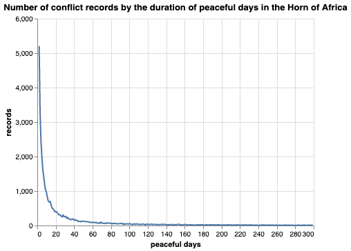

# Conflict Model 1: Baseline-V2

# Kimetrica Baseline Conflict Forcasting Model V2 (KiCFM2)ACLED
#### Scope: Horn of Africa (HoA: Ethiopia, Kenya, South Sudan, Somali, Sudan and Djibouti)
#### Duration: one year ahead
#### Frequency: monthly 
#### Admin level: admin2
#### Methodology: EasyEnsemble Classifier

# Introduction  

Armed conflicts that occur between one or more armed groups, such as government or non-government forces, are the cause of death and displacement in many countries. By the end of 2019, nearly 80 million people had been forcibly displaced worldwide due to armed conflict (Amnesty International, 2020). 

Appropriate early-warning systems that can meaningfully forecast the  conflict in its various forms are important tools in responding to the crisis ahead of time. This will have a significant impact on reducing the devastating consequence of conflict, including loss of life, livelihoods, and infrastructure. 

***KiCFM2*** is a continuation of the **baseline conflict model** that was intiated with an objective of forecasting armed conflict over time and space. In this version, we introduce the idea of peaceful days to isolate the recurrennt conflict (Figure 1). This was the major limitation of the baseline model where the model failed to identify new conflict from reccurent ones. 

*Figure 1: Number of 'peaceful days' rbefore the occurance of the next conflict event*


The unique feature of this model is that it enables users to specify the ***number of peacful days** after a conflict. Accordinagly, the approach can solve the limitation to identify new and recurrent conflict based on the figure shown above where conflict tends to drastically decrease as the number of peaceful days increase. In other words, it is possible to decrease the possibility of reccurence of conflict by increasing the number (1 beang "as it is"). 


### Model Outputs

**KiCFM2** forecasts new conflict, `conflict_onset_y`, the onset of new conflict after fourty or more peaceful days. This labeled as 0, no conflict; and 1, conflict.
The model produce outputs for the next one year period on monthly basis across the second adminstration level in Ethiopia.

### Model Inputs

Below is the list of input features that represent the **political, environmental, and demographic** variables that affect the occurance of conflict in the Ethiopian context. 

1. `peaceful_days`: duration of peaceful days before the next conflict incidence
2. `fatalities_per_event`: number of deaths due to conflcit per number of events
3. `youth_bulge`: proportion of youth population
4. `mean_rainfall`: average monthly rainfall in the previous months
5. `population_density`: mean number of people per KM2 per year
6. `conflict_onset`: onset of armed conflict incidence per month

### Runing the model under different scenario

Users can now set values to see the imact of changes in the important parameters by using the following command with default values:

```bash 
luigi --module models.conflict_model.tasks models.conflict_model.tasks.Predict \
 --peaceful-days 0 --youth-bulge-percentage-change 0.0 --mean-rainfall-percentage-change 0.0 \
 --fatalities-per-event-percentage-change 0.0 --local-scheduler
```
The values of the parameter can be changed using the following description:

1. `peaceful_days`: The number of days without conflict before the next conflict incident. Choices are 0, 30, and 60 with 0 representing the default or observed duration of peaceful days. When the user choose 30 or 60, the value will be added on each number of the observed peaceful days which decreases the likelihood of conflict. However, it has to be noted that the model becomes less accurate for higher values of peaceful days (30 or 60) due to class imbalance in the training data. Therfore, leaving at default value is recomended when altering other parameters of the model.
2. `fatalities_per_event`: Average number of fatalities per conflict event with choices 0.0, -0.5, and 0.5. The value 0.0 represent the default or observed avarage number of fatalities per event while values -0.5 or 0.5 implies a reduction or increase in the observed avarage number of fatalities per event by 50 percent, respectively. A positive relationship is assumed with the onset of conflict as inreased intensity of conflict in the form of loss of human lives inreases the liklihood of future conflict.
3. `youth_bulge`: The share of population in the 15 to 29 age bracket on yearly basis. Choices are 0.0, -0.05, and 0.05 with 0 representing the default or observed share of youth population. The value -0.05 or 0.05 implies a reduction or increase in the observed share of youth population by 5 percent, respectively. An positive relationship is assumed with the onset of conflict due to the linkage of youth bulge with youth unemployment which increases the likelihood of conflict.
4. `mean_rainfall`: Mean monthly rainfall with choices 0.0, -0.05, and 0.05. The value 0.0 represent the default or observed avarage monthly rainfall in mm while values -0.5 or 0.5 implies a reduction or increase in the observed share of mean rainfall by 50 percent, respectively. Overall, an inverse relationship is assumed with the onset of conflict as a reduction in rainfall increases the likelihood of drought which translate into conflict due to competetion over resources.

# Model Description

## Functional form
The objective here is to estimate the standard functional form of: 
```math
ŷ_{i,t+1} = f(y_{i,t-k:t}, x_{i,t-k:t}, s_{i})
```
Where, 
```math
ŷ_{i,t+1}
``` 
is a binary output representing future onset of conflict at the subnational level (1, conflict; 0, no conflict); 
```math
y_{i,t-k:t}

``` 
is current and past onset of conflict;
```math
x_{i,t-k:t}

```  
are dynamic input variables in the current and past state; 
```math
s_{i}

``` 
are static input variables such as location reference; and 
f(.) is the prediction function learned by the model.


## Model Selection

We evaluated different forms of algorithms that include the EasyEnsemble classifier, a standard random forests classifier, a logistic regression (classifier), the XGB classifier, as well as the Ada Boost classifiers.

The model performance criteria is based on a confusion matrix, which shows the extent to which a model is correctly classifying the conflict(True positive) and no-conflict/peaceful (True negative) events in the data. Depending on the nature of the problem, the target is to obtain large proportion of either one or both of these values. For instance health screening problems such as cancer identification aim to obtain large number of true positives as much as possible to avoid the risk of missing actual cases. In doing so, the algorithms might run into having low proportion of true negative values. Similarly, in the case of conflict, it might be advantageous to maximize the prediction of True negative values. As such, the best performing model is selected based on the number of conflict events classified correctly.

Accordingly, **EasyEnsemble Classifier** outperformed all other algorithms by having large number of True negative as well as a reasonable number of True positive. This is because, among other things, **EasyEnsemble Classifier** handles the issue of class imbalance. In this case, the classifier samples several subsets from the majority class and combines them for a final decision. These independent samples ultimately take into account the different aspects of the entire dataset.


