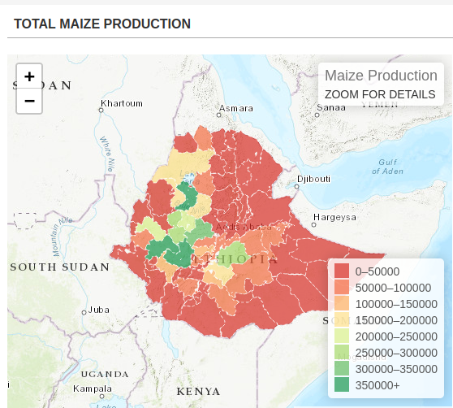
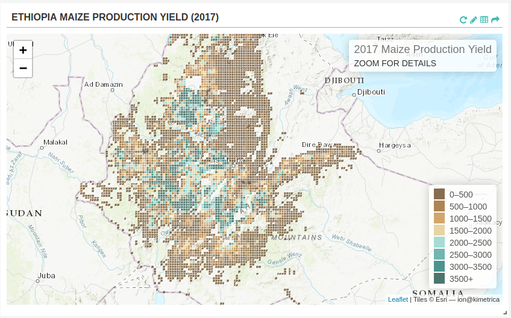

# Crop Model Overview
Crop-model framework allows users to run DSSAT v4.7 build ([Decision Support System for Agrotechnology Transfer](https://dssat.net/)) over large spatial extents based on grid points on spatial scale of 5 arc-minutes (approximately 8.3 km along Equator). The framework largely automates the labor-intensive processes of creating and running data ingest and transformation and allows researchers to run simulations that extend over large spatial extents, run for many growing seasons, or evaluate many alternative management practices or other input configurations.

The crop-model framework require daily weather data, soil surface and profile information, crop genetic information, and detailed crop management as input for simulating growth, development, and yield. The detailed gridded crop modeling results for each grid cell are aggregated using an area-weighted averaging method according [crop production managements practices](https://doi.org/10.7910/DVN/PRFF8V) namely: irrigated/high nitrogen, rain-fed high nitrogen, rain-fed low nitrogen and rain-fed subsistence. Finally, the results are further aggregated by second level administrative units of the country.

## Input Data
The inputs to the crop-model framework are:
- **Site weather data**
    - Latitude and longitude of the weather station*,
    - Daily values of incoming solar radiation (MJ/m²-day)*,
    - Maximum and minimum daily air temperature (ºC)*,
    - Daily total rainfall (mm)*,
    - Daily relative humidity (%),
    - Daily wind speed (km-day), and
    - Daily dew point temperature (°C). 

    The weather input data used, covering the period January 1983 to December 2021, was collated from [CHIRPS](https://www.chc.ucsb.edu/data/chirps) and [AgERA5](https://cds.climate.copernicus.eu/cdsapp#!/dataset/sis-agrometeorological-indicators).
- **Soil surface characteristics and soil profile data**
    - Desired soil surface data include: soil classification according to [NRCS](https://www.nrcs.usda.gov/wps/portal/nrcs/main/soils/survey/class/), surface slope, color (Munsell color system), permeability, and drainage class.
    - Soil profile data by soil horizons include: upper and lower horizon depths (cm), percentage sand, silt, and clay content, 1/3 bar bulk density, organic carbon, pH in water, aluminum saturation, and root abundance information.

    The soil data used by cro-model was downloaded from [Global High-Resolution Soil Profile Database for Crop Modeling Applications](https://doi.org/10.7910/DVN/1PEEY0).
- **Crop genetic information**

    Genetic coefficients are mathematical constructs designed to mimic the phenotypic outcome of genes under different environments to influence: (i) life cycle including fractional allocation to different phases, (ii) photosynthetic, (iii) vegetative, (iv) rooting, and (v) reproductive processes. Genetic coefficients has the following parameters:
    - ***Species parameters and functions***​: Defines the response of a crop to environmental conditions, including temperature, solar radiation, CO2 and photoperiod, as well as plant composition and other functions and parameters​.
    - ***Ecotype coefficients***​: Defines coefficients for groups of cultivars that show similar behaviour and response to environmental conditions.
    - ***Cultivar coefficients***​: Cultivar and variety specific coefficients, such as photothermal days to flowering & maturity, sensitivity to photoperiod, seed size, etc.

    Crop genetic information used in the crop-model are obtained from DSSAT genetic coefficients database with additional ones  obtained from [literature review](https://docs.google.com/spreadsheets/d/1vIWCLO91jEx1SCwCG9G3Ve2TIFNs4ZOl5_aQxtCvExI/edit?usp=sharing).
- **Crop management**
    - Planting details, irrigation and water management, fertilization, residue applications and harvest details. 

    The crop management practices information are obtained from DSSAT database and literature review.

- **Crop specific harvested area**
    - Cereals crops harvested area under irrigated portion of crop, rain-fed high inputs portion of crop, rain-fed low inputs portion of crop and rain-fed subsistence portion of crop.

    Crop specific harvested area data used in the crop-model was obtained from [Global Spatially-Disaggregated Crop Production Statistics Data for 2010 Version 2.0](https://doi.org/10.7910/DVN/PRFF8V).

- **Reference grid**
    - A reference grid assigned a unique ID to defines the location and soil type for each grid.

    The reference grid was developed by kimetrica for the whole Africa.

The input data described above for running crop-model in the horn of Africa region countries – Djibouti, Eritrea, Ethiopia, Kenya, Somalia, South Sudan, Sudan, and Uganda is stored in CKAN. For now the users can run simulations for maize, sorghum and millet. The crop-model allows the user to select crop cultivar from list provided depending per country.

## User inputs knobs
Crop-model framework allows users to change the following inputs for running crop model: country, crop, start_year, num_years, erain and management.
 - ***country-level***​: Defines the country to running simulation. User can select the country from the followin: Djibouti, Eritrea, Ethiopia, Kenya, Somalia, South Sudan, Sudan and Uganda. Default value is Ethiopia. Please note, South Sudan should be in quotation if selected.
 - ***crop***​: Defines the crop to simulation. Currently the user has a choice of maize or sorghum. Default value is maize.
 - ***start_year***​: Defines the simulation start year. The historical weather data covering the period January 1983 to December 2021, a total of 38 years. The user can select simulation start year within thi period. Default value is 2010.
 - ***num_years***: Defines the number of years to simulation after the start year. The number of User can Default value is 11.
 - ***erain***​: Defines rainfall modification available to generate new rainfall scenario from historical weather data for simulation period. User can choose a rainfall modification factor of 0.75, 0.50, 0.25 for less rainfall, 1.0 for normal rainfall and 1.25, 1.5, 1.75, 2.0 for more rainfall. Default value is 1.0 for normal rainfall. Rainfall modification creates rainfall scenario using observed rainfall amounts for running simulation.
 - ***management***​: Defines crop management practices uses by farmer. User can choose to run simulation as "irrig" (irrigated with high nitrogen), "rf_highN" (rain-fed with high nitrogen), "rf_lowN" (rain-fed with low nitrogen) or "rf_0N" (rain-fed with no nitrogen). Default value is "rf_lowN".

## Quickstart code
To run a Luigi task in a local environment, make sure the PYTHONPATH has been set to the right directories. It's recommended to run this inside Docker container built with Kimetrica's pre-defined requirements and dependencies (see instructions [here](https://gitlab.com/kimetrica/darpa/darpa)). Once the system is setup, in the terminal enter the Darpa root directory, execute `luigi --module <file_name> <task_name> --local-scheduler`


For example, run maize production in Ethiopia use the command below:
```bash
luigi --module models.crop_model.tasks models.crop_model.tasks.CropProductionCSV \
--crop maize --country-level Ethiopia --erain 1 --start-year 2010 --num-years 11 --management rf_lowN --local-scheduler
```
For example, run maize production in South Sudan use the command below:
```bash
luigi --module models.crop_model.tasks models.crop_model.tasks.HarvestedYieldGeotiffs --crop maize \
--country-level 'South Sudan' --erain 1 --local-scheduler
```
## Crop Model Output
The output of a crop model is total crop production. The crop model can output GeoTIFF, GeoJSON or CSV file. 
The task `HarvestedYieldGeotiffs` output raster file for each run. The number of bands in each raster is equal to number of
run years. To retrive the band for each year used the python codel below
```
import rasterio
with rasterio.open(raster_file) as src:
    tags = src.tags()
print(tags)
```
The task `CropProductionCSV` output a csv file of crop production aggregated at admin level 2.

The task `CropProductionAtAdmin2GeoJson` output a GeoJSON file for crop production at admin level 2.

<div align='center'><fig><figcaption>Fig.1. Crop model GeoJSON output. </figcaption></div>
<br>
<div align='center'><fig><figcaption>Fig.2. Crop model GeoTIFF output. </figcaption></div>
<br>
