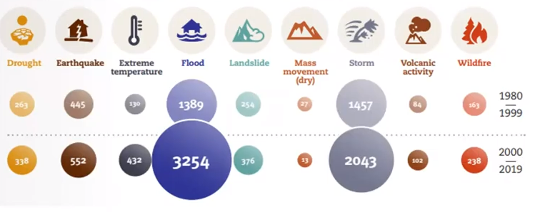
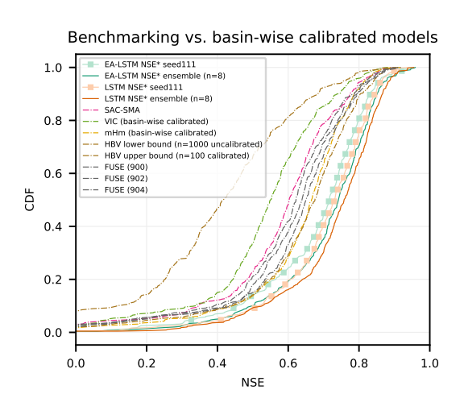
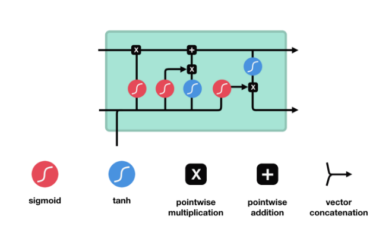
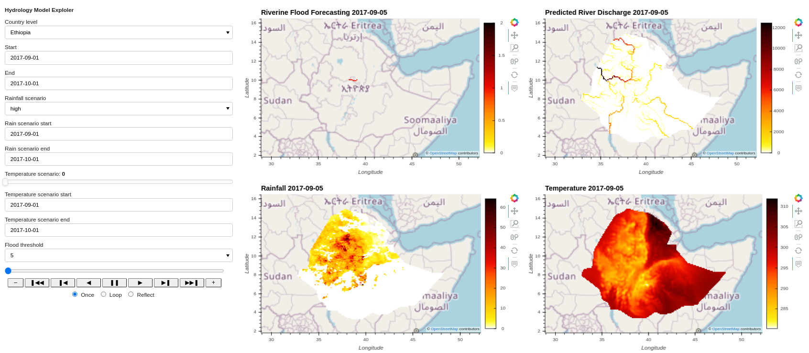

# River Discharge Model
According to [Centre for Research on the Epidemiology of Disasters (CRED)](https://www.cred.be/) 
floods were the most frequent natural disasters occurring worldwide from 2000 to 2019. 
The frequency of floods occurrence is also increasing, rising from 71 events per year on average between 1980 and 1999 to an annual average of 171 events in the period between 2000-2019.

Our aim is to develop a riverine flood forecasting model that scales to different regions with no manual calibration.

<div align='center'><fig><figcaption>Fig.1: Total disaster events by type: 1980-1999 vs 2000-2019 (Source: CRED)</figcaption></div>
<br>
The model uses a data driven approach to forecast river discharge.
River discharge is the amount of water that flows through a river section at a given time. 
We combine our predicted river discharge values with flood threshold (the capacity of a river to cause flooding) to calculate the total extent of flooding. 
A single Long Short-Term Memory Network (LSTM) is trained using past values of discharge, meteorological time series data and static attributes.
[Kratzert et al.](https://arxiv.org/abs/1907.08456) shows a single universal deep learning model can learn both regionally-consistent and 
location-specific hydrologic behaviors. [Kratzert et al.](https://arxiv.org/abs/1907.08456) benchmarked the LSTM model with classical hydrology models.


<div align='center'><fig><figcaption>Fig.2: The distribution of Nash–Sutcliffe model efficiency coefficient (NSE) used to assess the predictive skill of hydrological models. (Source: Kratzert et al.)</figcaption></div>


## Data
The Copernicus Climate Data Store (CDS) API is used to scrape the following datasets:
* GloFAS Daily river discharge ($`m^3 s^{-1}`$).
* ERA5-Land hourly 2 meter temperature data (kelvin).
* Upstream area in ($`m^2`$).

To use the Copernicus Climate Data Store (CDS) API, user id and key are required to be added to the `.env` file. 
Therefore first create an CDS account [here](https://cds.climate.copernicus.eu/user/register/) and 
visit [this page](https://cds.climate.copernicus.eu/user/) to get the user id and the key.

The Climate Hazards group Infrared Precipitation with Stations (CHIRPS) is the source of the daily rainfall data.  
It is scrapped from https://data.chc.ucsb.edu/products/CHIRPS-2.0/africa_daily/tifs/p05/.

The source of the digital elevation model (DEM) is HydroSHEDS.

## Data preprocessing
The script [data_pre](https://gitlab.com/kimetrica/darpa/darpa/-/blob/master/models/hydrology_model/river_discharge/data_pre.py) 
scrapes, resample and compile data from various sources into an [xarray](http://xarray.pydata.org/en/stable/) dataset that is used to train the model.
Data preprocessing steps include:
* Scraping river discharge from [Copernicus Climate Data Store](https://cds.climate.copernicus.eu/cdsapp#!/dataset/cems-glofas-historical?tab=overview)
* Scraping upstream area from [Copernicus Climate Data Store](https://cds.climate.copernicus.eu/cdsapp#!/dataset/cems-glofas-historical?tab=overview)
* Scraping temperature data from [Copernicus Climate Data Store](https://cds.climate.copernicus.eu/cdsapp#!/dataset/reanalysis-era5-land?tab=overview)
* Scraping rainfall data from [Climate Hazards group Infrared Precipitation with Stations (CHIRPS)](https://data.chc.ucsb.edu/products/CHIRPS-2.0/africa_daily/tifs/p05/)
* Hourly 2 meter temperature data is aggregated to get daily data.
* Rainfall and digital elevation data is resampled to match the spatial resolution of the river discharge.
* Before training the model the data is normalized to a mean of 0 and a standard deviation of 1.

The data used for inference is pre-processed and saved in CKAN as a netcdf file. The temporal coverage of pre-processed data is from Jan 2017 to Dec 2018 for both South Sudan and Ethiopia.

## Building the model
<div align='center'><fig><figcaption>Fig.3: The Long Short-Term Memory networks (LSTM) model architecture </figcaption></div>
<br>
The Long Short-Term Memory networks (LSTM) model is trained with the meteorological time series data and static location specific attributes. 
The length of input sequence is 60.

LSTM is a type of neural network arichitecture that is optimized for time series prediction that requires long memory. 
The key to LSTMs is the cell state and various gates.
Cell state carries relevant information throughout the processing of the sequence. 
The information gets added or removed to the cell state via gates.
During training the gates learn which information is relevant to keep or forget.

```math
    f_{t} = \sigma(W_{f}.[h_{t-1}, x_{t}] + b_{f})
```
```math
    i_{t} = \sigma(W_{i}.[h_{t-1}, x_{t}] + b_{i})
```
```math
    g_{t} = tanh(W_{g}.[h_{t-1}, x_{t}] + b_{g}
```
```math
    C_{t} = f_{t} * C_{t-1} + i_{t} * g_{t}
```
```math
    o_{t} = \sigma(W_{o}.[h_{t-1}, x_{t}] + b_{o}
```
```math
    h_{t} = o_{t} * tanh(C_{t})
```

where: $`f_{t}`$ is the forget gate, $`i_{t}`$ is the input gate,
$`g_{t}`$ is the cell input, $`C_{t}`$ is the cell state, $`C_{t-1}`$ is the previous cell state,
$`o_{t}`$ is the output gate, $`h_{t}`$ is the hidden state, $`h_{t-1}`$ is the previous hidden state, and  $`x_{t}`$ is the input.

## Model output
The model forecasts river discharge and estimates riverine flooding at daily time steps.
<div align='center'><fig><figcaption>Fig.4: Hydrology Model Exploler </figcaption></div>

## Quickstart code
### River Discharge
The model forecasts river discharge at daily time steps in both South Sudan and Ethiopia. 
The model output are available in NetCDF and parquet format. 

River discharge tunable parameters include:
* name: country_level
  * description: Set the spatial extent of outputs to a country.
  * metadata:
    * type: ChoiceParameter
    * default: "South Sudan"
* name: geography
  * description: Spatial extent of outputs, as a GeoJSON object.
  * metadata:
    * type: GeoParameter
    * default: GeoParameter(default=Polygon(coordinates=[[(23, 12.5), (23, 2), (36, 2), (36, 12.5), (23, 12.5)]]))
* name: time
  * description: Temporal extent, of outputs as a date range (excluding the end date).
  * metadata:
    * type: TimeParameter
    * default: 2017-01-01-2017-06-01
* name: rainfall_scenario
  * description: Use current rainfall data or use a scenario based on deviations from daily long term mean.
  * metadata:
    * type: ChoiceParameter
    * default: normal
* name: rainfall_scenario_time
  * description: The time period for the rainfall scenario
  * metadata:
    * type: TimeParameter
    * default: 2017-05-01-2017-05-02
* name: rainfall_scenario_geography
  * description: Spatial extent of rainfall scenario
  * metadata:
    * type: GeoParameter
    * default: GeoParameter(default=Polygon(coordinates=[[(23, 12.5), (23, 2), (36, 2), (36, 12.5), (23, 12.5)]]))
    
Below are examples of commands that predict river discharge in Ethiopia for the time  period 2017-01-01 to 2017-02-03:
* Netcdf output format command:
```bash
luigi --module models.hydrology_model.river_discharge.tasks models.hydrology_model.river_discharge.tasks.PredictRiverDisharge \
--local-scheduler --country-level Ethiopia --time 2017-01-01-2017-02-03
```
* Parquet output format command:
```bash
luigi --module models.hydrology_model.river_discharge.tasks models.hydrology_model.river_discharge.tasks.RiverDischargeToParquet \
--local-scheduler --country-level Ethiopia --time 2017-01-01-2017-02-03
```

### Riverine Flooding
The model also estimate the riverine flooding. If the predicted river discharge 
exceeds flood threshold and the basin is greater than 5,000 km2, the pixel is classified as flooded. 
The role of flood defences is not considered.

Riverine Flooding tunable parameters include:
* name: country_level
  * description: Set the spatial extent of outputs to a country.
  * metadata:
    * type: ChoiceParameter
    * default: "South Sudan"
* name: geography
  * description: Spatial extent of outputs, as a GeoJSON object.
  * metadata:
    * type: GeoParameter
    * default: GeoParameter(default=Polygon(coordinates=[[(23, 12.5), (23, 2), (36, 2), (36, 12.5), (23, 12.5)]]))
* name: time
  * description: Temporal extent, of outputs as a date range (excluding the end date).
  * metadata:
    * type: TimeParameter
    * default: 2017-01-01-2017-06-01
* name: rainfall_scenario
  * description: Use current rainfall data or use a scenario based on deviations from daily long term mean.
  * metadata:
    * type: ChoiceParameter
    * default: normal
* name: rainfall_scenario_time
  * description: The time period for the rainfall scenario
  * metadata:
    * type: TimeParameter
    * default: 2017-05-01-2017-05-02
* name: rainfall_scenario_geography
  * description: Spatial extent of rainfall scenario
  * metadata:
    * type: GeoParameter
    * default: GeoParameter(default=Polygon(coordinates=[[(23, 12.5), (23, 2), (36, 2), (36, 12.5), (23, 12.5)]]))
* name: return_period_threshold
  * description: The return period discharge magnitudes used as flood thresholds.
  * metadata:
    * type: IntParameter
    * default: 10
    
Below are examples of commands that estimate riverine flood extent in Ethiopia for the time  period 2017-08-01 to 2017-10-01:
* Netcdf output format command:
```bash
luigi --module models.hydrology_model.river_discharge.tasks models.hydrology_model.river_discharge.tasks.RiverFlooding \
--local-scheduler --country-level Ethiopia --time 2017-08-01-2017-10-01
```

* Parquet output format command:
```bash
luigi --module models.hydrology_model.river_discharge.tasks models.hydrology_model.river_discharge.tasks.RiverFloodingToParquet \
--local-scheduler --country-level Ethiopia --time 2017-08-01-2017-10-01
```

## Constraints
The LSTM model for predicting river discharge is run in sequence-to-value mode. The discharge values in the sequence are the observed values and not the predicted values.
