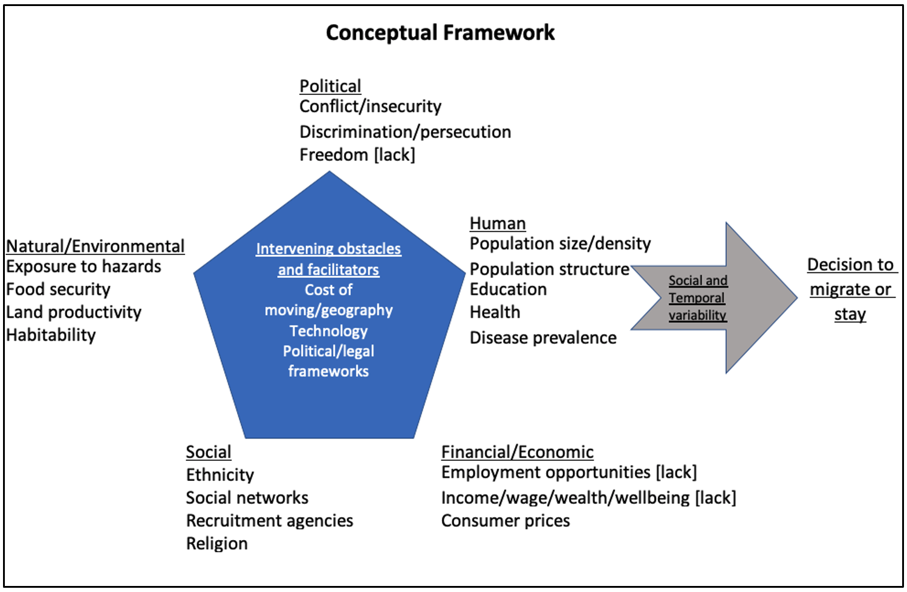
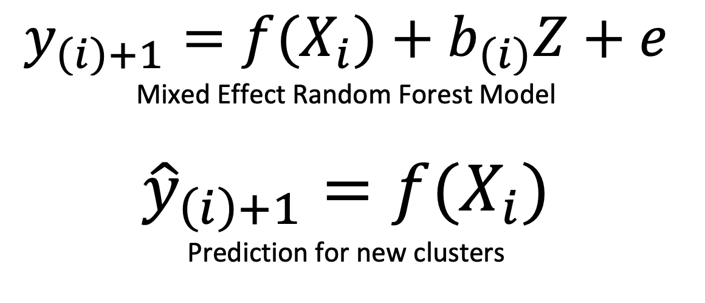

# Internal Displacement Model

## Introduction 

According to the UNHCR, the global forced displacement surpassed  80 million people at the mid-2020 out of which over 46 million were internally displaced people (IDPs). It is also anticipated that the problem will grow in the foreseeable future due to conflict, climate change and natural disasters. 

The massive displacement requires the allocation of emergency resources to the affected population which includes shelter, food, and healthcare. Also, humanitarian organizations need to be prepared regarding feature displacement for effective aid allocation. As such, insights into the dynamics of forced displacement over time and space have importance in supporting humanitarian and development decisions in affected countries. The current model allows users to predict internal displacement at one quarter ahead of time and at admin two level in Ethiopia. 

## Target variable: Percent of displaced population in the next quarter

Predicting forced displacement has been challenging due to the lack of data. To fill this gap, recent research focused on the use of artificial intelligence and remote sensing tools. For instance, Green and Blanford (2020) used aerial and satellite images to drive estimates of displaced populations in camps. Their work shows that high-resolution satellite imagery can be used to map physical structures in refugees and IDP camps, including changes to the number and type of these structures over time. The authors also indicated that the accuracy of automated tools relies on well-defined classifiers that are geographically and temporally transferable.

We use the displacement Site Assessment (SA) tracking data from IOM DTM(Displacement Matrix) that tracks the number and multisectoral needs of internally displaced persons (IDPs) on a quarterly basis (approximation) to drive the historical data on displacement. 

The IDP stock in our case country, Ethiopia, has reached 1.96 million that are spread across 1,222 sites in 11 regions by the end of January 2021 out of which conflict and drought displaced an estimate of 1.2 million (61%), and 400 thousand (20%) people, respectively (DTM, April 2021). 

Our focus is on the number of newly displaced persons tracked in 24 rounds of quarterly surveys conducted from late 2017 to Jan 2021. To arrive at newly displaced persons per quarter, we took the difference in the number of displaced persons in the consecutive rounds of surveys. Then, the quarterly data was correlated with the lag of cumulative figures of input variables calculated on a quarterly basis. Introducing lag in the time series enabled the model to forecast one quarter ahead of time. 

## Conceptual Framework
We consider the influence of a range of factors in forcing people to flee their homes. Here, we use a framework for understanding the effect of environmental migration at the micro and macro level (Black et al., 2011) that draws on increased evidence base on the topic.  The framework identifies five families of factors of migration decisions, namely; political, economic, social, demographic and environmental drivers. In the figure below, individual migration decisions and flows are affected by these drivers operating in combination. 

## Final Input variables:

Following the above mental model, we tested a total of 17 factors which include political, environmental, demographic and socio-economic variables were considered for the model. Political indicators were mostly derived from the ACLED dataset by transforming the data to create new indicators. Other data sets have been accessed from different open sources. To this end, we arrived to the following 9 indicators after performing feature selection.
1. `peaceful_days`: mean duration of peaceful days before the next conflict incidence
2. `fatalities_per_event`: number of deaths due to conflict per number of events
3. `ethnicity_count`: mean number of ethnic groups at admin two level
4. `drought_index`: mean evaporative stress index per quarter
5. `mean_rainfall`: average monthly rainfall per quarter
7. `population_density`: mean number of people per KM2 per quarter
8. `youth_bulge`:proportion of youth population

## Mixed Effect Random Forest (MERF) Model

We employed Mixed Random Forest (MERF) algorithm. MERFs can be viewed as a method that combines the best of conventional linear mixed effects models with the power of machine learning in non-parametric modeling. Like Linear Mixed Effects (LME) which is a special case of a hierarchical Bayesian model, the MERF model assumes a generative model of the form:

Where;

•	`y` is the target variable (proportion of displaced population).
•	`X` is the fixed effect features. X is assumed to be p dimensional, e.g. conflict_onset, population_density, etc.
•	`Z` is the random effect features (cluster or location variable). 
•	`e` is independent, identically distributed (iid) noise. It is distributed as N(0, sigma_e²)
•	`i` is the cluster index. We assume that there are k clusters in the training data.
•	`bi` is the random effect coefficients. They are different per cluster i but are assumed to be drawn from the same distribution. 

The unique feature of MERFs is its ability to model datasets with non-negligible random effects, or large differences by cluster such as country pair over time. Our dataset cluster column is represented by the admin names. The advantages of MERFs comes from the fact that the model controls for the variation at cluster level compared to modeling the whole dataset without including the cluster specific effects. This means that the model takes into account the nature of displacement from specific locations that might exhibit certain differences compared to other countries. 

## Running the model under different scenarios

Users can now set values to see the imact of changes in the important parameters by using the following command with default values:

`luigi --module models.internal_displacement_model.tasks models.internal_displacement_model.tasks.Forecast --peaceful-days-offset 0 --ethnicity-count-offset 0 --mean-rainfall-scenario 0.5 --drought-index-scenario 0.5 --fatalities-per-event-scenario -0.5 --local-scheduler`

The values of the parameter can be changed using the following description:

1. `peaceful_days_offset` 
default=0,
choices=[0, 30, 60],
var_type=int,
description=The number of days without conflict before the next conflict incident. Choices are 0, 30, and 60 with 0 representing the default or observed duration of peaceful days. When the user choose 30 or 60, the value will be added on each number of the observed peaceful days which decreases the likelihood of conflict their by reducing the number of displaced population.
2. `ethnicity_count_offset`
default=0,
choices=[0, 3, 6],
var_type=int,
description="The number of of ethnic groups living in each administration. Choices are 0, 3, and 6 with 0 representing the default or observed duration of peaceful days. When the user choose 3 or 6, the value will be added on each number of ethnic groups which might increase the likelihood of conflict there by increasing the number of displaced population due to competition over resources.
3. `fatalities_per_event_scenario` 
default=0.0,
choices=[0.0, -0.50, 0.50],
var_type=float,
description="Average number of fatalities per conflict event with choices 0.0, -0.5, and 0.5. The value 0.0 represents the default or observed average number of fatalities per event while values -0.5 or 0.5 imply a reduction or increase in the observed average number of fatalities per event by 50 percent, respectively. A positive relationship is assumed with the number of displaced population due to conflict as increased intensity of conflict in the form of loss of human lives increases the likelihood of future displacement.
4. `drought_index_scenario`
default=0.0,
choices=[0.0, -0.50, 0.50],
var_type=float,
description="mean evaporative stress index per quarter with choices 0.0, -0.05, and 0.05. The value 0.0 represents the default or observed average monthly drought while values -0.5 or 0.5 imply a worsening and improving drought situation by 50 percent, respectively. Overall, an inverse relationship is assumed with displacement as an increase in the drought level(decrease in the value of the drought index) increases the likelihood of drought which translates into conflict and displacement due to competition over resources.
5. `mean_rainfall_scenario` 
default=0.0,
choices=[0.0, -0.50, 0.50],
var_type=float,
description="Mean quarterly rainfall with choices 0.0, -0.05, and 0.05. The value 0.0 represents the default or observed average monthly rainfall in mm while values -0.5 or 0.5 imply a reduction or increase in the observed share of mean rainfall by 50 percent, respectively. Overall, an inverse relationship is assumed with the onset of conflict as a reduction in rainfall increases the likelihood of drought which translates into conflict due to competition over resources.