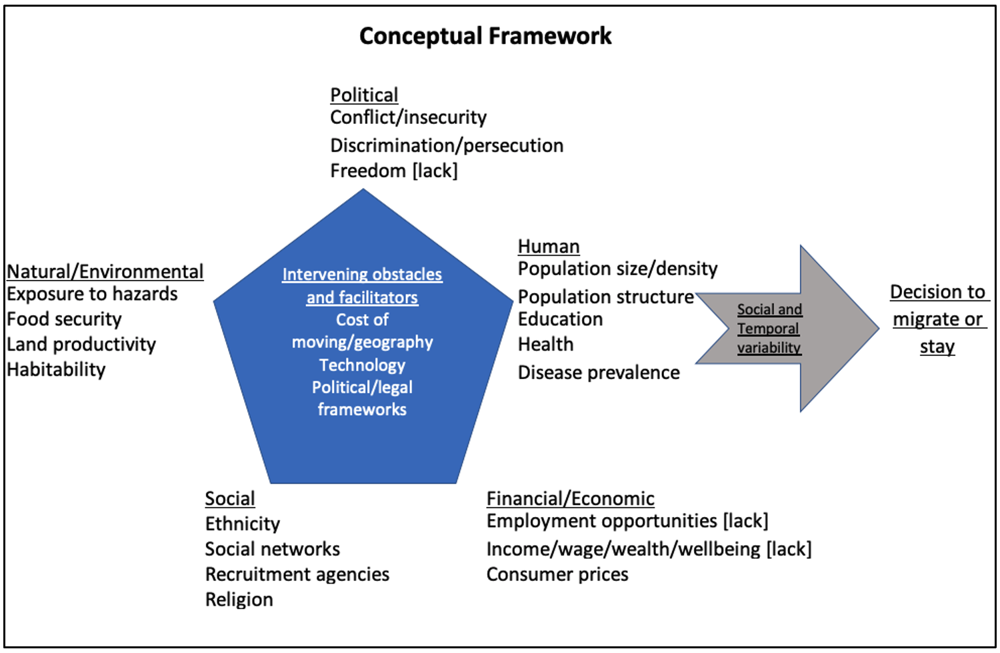
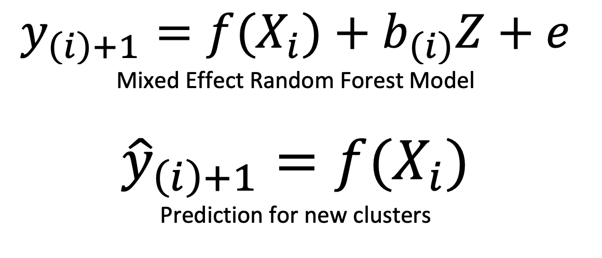

# International Displacement Model

## Introduction 

The international displacement model assesses international forced displacement sources, destinations, and volumes due to insecurity and conflict. It predicts the number of refugees from the country of origin to country of destination one year into the future at national level. The input variables 
are collected primarily from the World Bank Indicator Data Base using `wbgapi` package.

## Conceptual Framework
We consider the influence of a range of factors in forcing people to flee their homes and cross international borders. Here, we use a framework for understanding the effect of environmental migration at the micro and macro level (Black et al., 2011) that draws on increased evidence based on the topic.  The framework identifies five families of factors of migration decisions, namely; political, economic, social, demographic and environmental drivers. In the figure below, individual migration decisions and flows are affected by these drivers operating in combination. 

## Target variable: Number of internationally displaced population (refugee) in the next year

* **[o] refugee_y**: accessed from the UNHCR Population Statistics Database (popstats.unhcr.org), this is the target variable which consists of the stock of refugee counts recognized under the UNHCR definition as well as a refugee-like situation. It includes the number of refugees with a pair of countries of origin and destination for the years between 1951 and 2020.

## Final Input variables:
The variables used to develop the model to predict the number of refugees are listed below. The terms o and d refers to the availability of the variable for origin and destination, respectively.

* **[o,d] displacement**: The number of conflict induced internally displaced population at origin and destination, respectively.
* **[o,d] gdp_percapita**: the level of per capita income at origin and destination, respectively. GDP per capita is gross domestic product divided by midyear population at origin estimated number of populations. 
* **[o,d] population**:total number of population at origin and destination, respectively.

* **[o, d] inflation**: the level of inflation at origin and destination, respectively.
* **distance**: the distance between the capital city of the origin and destination country measured in KM.
* **share_border**: a dummy variable representing 1 if a the origin country shares a border with the destination country, 0, otherwise. 

## Mixed Effect Random Forest (MERF) Model

We employed a Mixed Random Forest (MERF) algorithm. MERFs can be viewed as a method that combines the best of conventional linear mixed effects models with the power of machine learning in non-parametric modeling. Like Linear Mixed Effects (LME) which is a special case of a hierarchical Bayesian model, the MERF model assumes a generative model of the form:

Where;

•	`y` is the target variable (number of refugees).
•	`X` is the fixed effect features. X is assumed to be p dimensional, e.g. o_displacement, d_displacement,  etc.
•	`Z` is the random effect features (cluster or location variable). 
•	`e` is independent, identically distributed (iid) noise. It is distributed as N(0, sigma_e²)
•	`i` is the cluster index. We assume that there are k clusters in the training data.
•	`bi` is the random effect coefficients. They are different per cluster i but are assumed to be drawn from the same distribution. 

The unique feature of MERFs is its ability to model datasets with non-negligible random effects, or large differences by cluster such as country pair over time. Our dataset cluster column is represented by the admin names. The advantages of MERFs comes from the fact that the model controls for the variation at cluster level compared to modeling the whole dataset without including the cluster specific effects. This means that the model takes into account the nature of displacement from specific locations that might exhibit certain differences compared to other countries. 

## Running the model under different scenarios

Users can now set values to see the impact of changes in the important parameters by using the following command with default values:

`luigi --module models.international_displacement_model.tasks models.international_displacement_model.tasks.Forecast --o-displacement 0.0 --o-gdp-pcap 0.0 --d-displacement 0.0 --d-gdp-pcap 0.0  --local-scheduler`

The values of the parameter can be changed using the following description:

1. `o_displacement_percentage_change` = ChoiceParameter(
        default=0.0,
        choices=[0.0, -0.5, 0.5],
        var_type=float,
        description="The number of conflict induced internally displaced population at origin. Choices are 0.0, -0.5, and 0.5 with 0 representing the default or observed number of displaced population. The value -0.5 or 0.05 implies a reduction or increase in the observed displaced population by 50 percent, respectively. A positive relationship is assumed with the international displacement where an increase in internal displacement directly contribute to the number of people corssing their country border.")
2. `o_gdp_pcap_percentage_change` = ChoiceParameter(
        default=0.0,
        choices=[0.0, -0.5, 0.5],
        var_type=float,
        description="The level of per capita income at origin. Choices are 0.0, -0.5, and 0.5 with 0 representing the default or observed number of per capita income. The value -0.5 or 0.05 implies a reduction or increase in the observed per capita income by 50 percent, respectively. An inverse relationship is assumed with the international displacement where an increase income reduce the number of people crossing their country borders due to better opportunities within their country border.")
    
3. `d_displacement_percentage_change` = ChoiceParameter(
        default=0.0,
        choices=[0.0, -0.5, 0.5],
        var_type=float,
        description="The number of conflict induced internally displaced population at the destination. Choices are 0.0, -0.5, and 0.5 with 0 representing the default or observed number of displaced population. The value -0.5 or 0.05 implies a reduction or increase in the observed displaced population by 50 percent, respectively. An inverse relationship is assumed with the international displacement where an increase in internal displacement at the destination means that there is less opportunity for internationally displaced population to stay in areas where there is ongoing displacement at destination.")
4. `d_gdp_pcap_percentage_change` = ChoiceParameter(
            default=0.0,
            choices=[0.0, -0.5, 0.5],
            var_type=float,
            description="The level of per capita income at destination. Choices are 0.0, -0.5, and 0.5 with 0 representing the default or observed number of per capita income. The value -0.5 or 0.05 implies a reduction or increase in the observed per capita income by 50 percent, respectively. A positive relationship is assumed with the international displacement where an increase the level of income at destination attracting more people crossing destination's country border as people expect better opportunities at destination.")