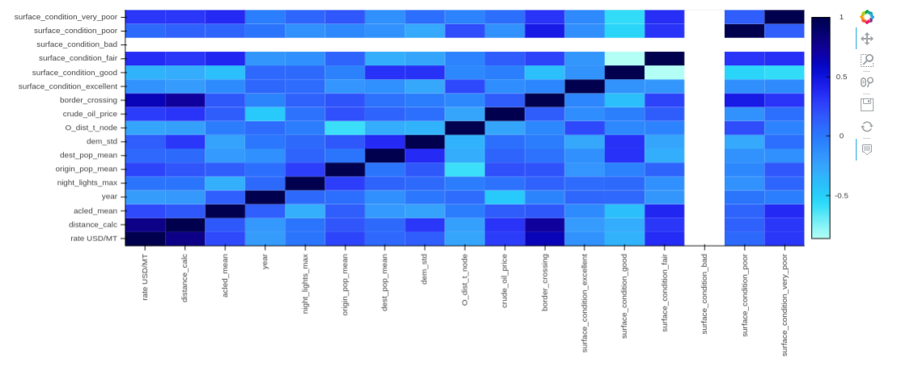
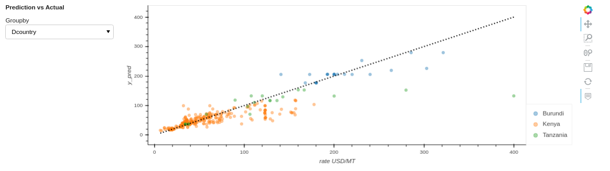
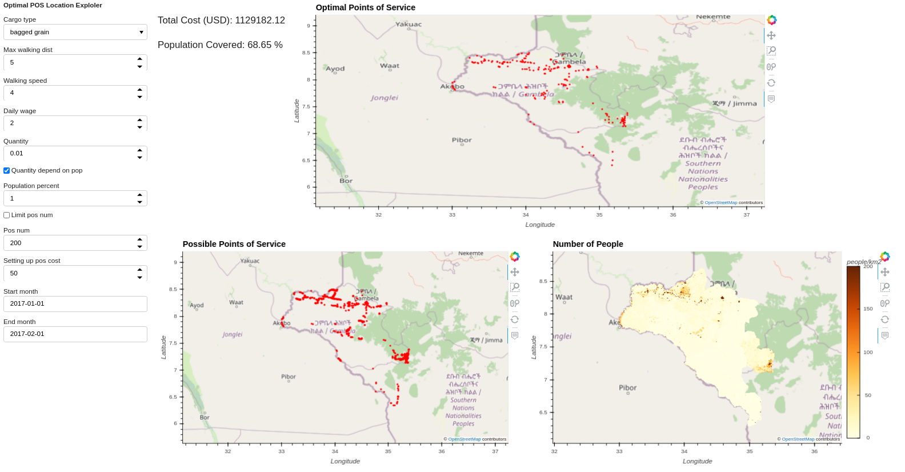
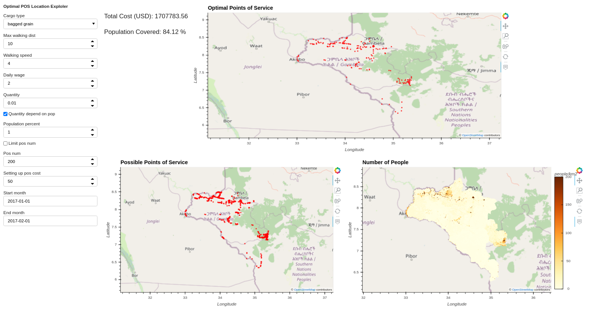

# Logistic and Supply Chain Model
The objective of the Logistics and Supply Chain Model is to support critical 
operational and tactical decision-making relating to the supply of essential 
goods and services, with a focus on emergency distributions and public sector interventions.

The model estimates the probable logistics costs of an intervention with a focus on 
the distribution of items such as relief food assistance, vaccines or mosquito nets.

The model informs operational and tactical responses for interventions, 
through the identification of optimal supply chain solutions (network design, 
routing, storage and distribution planning).


### Freight Rate Model
The logistic model estimates the transportation tariff in US dollar per tonne for a 
given origin and destination.

### Input Data
* Distance from origin to destination,  source OSM maps
* Conflict data  source [ACLED](https://acleddata.com/curated-data-files/)
* Distance from the origin to the road network source OSM
* Distance from the destination to the road network source OSM
* Origin country
* Destination country
* Digital elevation model
* Night time light, source [NOAA](https://data.ngdc.noaa.gov/instruments/remote-sensing/passive/spectrometers-radiometers/imaging/viirs/dnb_composites/v10/2015/)
* Year
* Month
* Road surface condition
* Crude oil price

### Data Preprocessing
The script [data_pre](https://gitlab.com/kimetrica/darpa/darpa/-/blob/master/models/logistic_model/data_pre.py)
scrape road network data from OSM. 
Summary statistics for various routes are extracted from gridded variables. The raster inputs are:
* Conflict
* Road surface condition
* Night time light
* Digital elevation model


*Figure 1: Correlation matrix*


### Model
ExtraTreesRegressor model is trained to predict the cost of transportation for a given route. 
ExtraTreesRegressor is a tree-based ensemble method for regression problems. It essentially consists of 
randomizing strongly both attribute and cut-point choice while splitting a tree node.

The [tasks.py](https://gitlab.com/kimetrica/darpa/darpa/-/blob/master/models/logistic_model/tasks.py) 
file takes all of the pre-processed, pre-assembled data to
train ExtraTreesRegressor model. The `Train` task sets all of the
hyperparameters and trains the model.

*Figure 2: Predicted vs actual freight rate*


### Model Output
The model outputs a geojson with all the predictors and `rate USD/MT`.
Example output:
```
{
"type": "FeatureCollection",
"crs": { "type": "name", "properties": { "name": "urn:ogc:def:crs:OGC:1.3:CRS84" } },
"features": [
{ "type": "Feature", "properties": { "cargo_type": "bagged grain", "Dcountry": "Ethiopia", "Dlatitude": 6.3458333333329513, "Dlongitude": 35.0958333333325, "col": 251, "dest_pop_max": 293.0, "dest_pop_mean": 8.5472837022132797, "dest_pop_median": 2.0, "dest_pop_min": 0.0, "possible_pos": 1, "row": 283, "dest_pop_std": 23.882809912611364, "dest_pop_sum": 4248.0, "Olongitude": 34.587005, "Olatitude": 8.251123, "Ocountry": "Ethiopia", "origin": "Gambela", "origin_pop_max": 6642.0, "origin_pop_mean": 78.361829025844926, "origin_pop_median": 4.0, "origin_pop_min": 0.0, "origin_pop_std": 494.15125570330758, "origin_pop_sum": 39416.0, "distance_calc": 471008.26460398582, "O_dist_t_node": 94.929223651003724, "D_dist_t_node": 9110.8373803348186, "dem_min": 438.0, "dem_max": 2554.0, "dem_mean": 1359.8944091796875, "dem_std": 572.423828125, "dem_median": 1372.0, "night_lights_min": 0.0, "night_lights_max": 2.332709789276123, "night_lights_mean": 0.0011826853733509779, "night_lights_std": 0.021682078018784523, "night_lights_median": 0.0, "acled_min": 0.0, "acled_max": 33.0, "acled_mean": 12.0, "acled_std": 13.583077430725098, "acled_median": 7.5, "surface_condition_good": 0.1505050505050505, "surface_condition_fair": 0.28828282828282831, "surface_condition_bad": 0.0, "surface_condition_excellent": 0.10929292929292929, "surface_condition_poor": 0.38848484848484849, "surface_condition_very_poor": 0.06343434343434344, "month": 1, "year": 2017, "crude_oil_price": 53.59, "border_crossing": 0, "rate USD\/MT": 50.010391624333572 }, "geometry": { "type": "MultiLineString", "coordinates": [ [ [ 34.5878655, 8.2510628 ], [ 34.5878204, 8.2508639 ], [ 34.5877491,
```
## Optimal Points of Service Model
The objective is to minimize the cost walking from population point to Points of Servic (POS) 
and the cost of transporting cargo from the warehouse to POS.

### Model Description
The first term of the objective function is the cost incurred by the 
beneficiaries to travel to and from the POS. The second term is the freight 
rate from warehouse to the POS and the third term is the fixed cost of setting up POS.

#### Sets
- $`I`$: Set of population points, $`i \in I`$
- $`J`$: Set of potential point of Service (POS), $`j \in J`$

#### Scalars
- $`r`$: is the coverage radius

#### Parameters
- $`p_{i}`$: Population residing in population point $`i \in I`$

- $`d_{i}`$: Demand of population point $`i \in I`$. The demand can be fixed or a multiple of $`p_{i}`$

- $`l_{ij}`$: Great circle distance between population point $`i \ in I`$ and potential POS $`j \in J`$

- $`\alpha_{ij}`$: Is the cost of walking from population point $`i \in I`$ to potential POS $`j \in J`$

- $`\beta_{j}`$: Freight rate

- $`k_{ij}`$: 1, if $`l_{ij} \leq r`$ else 0

- $`z_{i}`$: 1, if $`\sum_{j \in J} k_{ij} \ge 0`$ else 0

- $`\omega_{j}`$: The fixed cost of setting up POS

#### Decision Variables
- $`x_{ij}`$: Binary variable equals to 1 if and only if population point $`i \in I`$ is assigned to POS $`j \in J`$

- $`y_{j}`$: Binary variable equals to 1 if and only if the potential POS $`j \in J`$ is optimal


#### Model
minimize
```math 
\sum_{i \in I}\sum_{j \in J} \alpha_{ij} p_{i} x_{ij} +  \sum_{i \in I}\sum_{j \in J} \beta_{j} d_{i} x_{ij} + \sum_{j \in J} \omega_{j} y_{j}
```

Constraints
```math
x_{ij} \leq y_{j} k_{ij}
```
```math
\sum_{j \in J} x_{ij} \leq z_{i}
```
```math
x_{ij}, y_{j} \in {{0, 1}}
```

### Model Output
The model output a two csv files:
* `output/final_targets/logistic_model/optimal_pos{hash}.cs`. This csv files shows the optimal points of service.
* `output/final_targets/logistic_model/optimal_route{hash}.csv`. This csv files shows the optimal route from population point to point of service.


The command for running the model over Oromia with maximum walking distance set to 5 km:
```bash
luigi --module models.logistic_model.tasks models.logistic_model.tasks.OPtimalPOSLocation\
 --local-scheduler --geography /usr/src/app/models/geography/boundaries/gambela.geojson \
 --time 2017-01-01-2017-02-01 --cargo-type 'bagged grain' --country-level Ethiopia --max-walking-dist 5\
 --population-percent 1
```
*Figure 3: Optimal point of service explorer (max-walking-dist = 5)*


The command for running the model over Oromia with maximum walking distance set to 10 km:
```bash
luigi --module models.logistic_model.tasks models.logistic_model.tasks.OPtimalPOSLocation\
 --local-scheduler --geography /usr/src/app/models/geography/boundaries/gambela.geojson \
 --time 2017-01-01-2017-02-01 --cargo-type 'bagged grain' --country-level Ethiopia --max-walking-dist 10\
 --population-percent 1
```
*Figure 4: Optimal point of service explorer (max-walking-dist = 10)*


### Tunable Parameters
* name: max_walking_dist:
  * description: The maximum distance beneficiaries can walk from population point to POS.
  * metadata:
    * type: FloatParameter
    * default: 5.0
* name: walking_speed
  * description: Beneficiaries walking speed.
  * metadata:
    * type: FloatParameter
    * default: 4.0
    * unit: km/hr
* name: daily_wage
  * description: Beneficiaries daily wage
  * metadata:
    * type: FloatParameter
    * default: 2.0
    * unit: US dollar per day (8 hours)
* name: quantity
  * description: The demand by the beneficiaries in tonnes.
  * metadata:
    * type: FloatParameter
    * default: 0.01
    * unit: tonnes
* name: quantity_depend_on_pop
  * description: If the quanity depend of the population. If true the {quantity} is multiplied by the number of beneficiaries.
  * metadata:
    * type: BoolParameter
    * default: False
* name: limit_pos_num
  * description: If to limit the number of point of service
  * metadata:
    * type: BoolParameter
    * default: False
* name: pos_num
  * description: The number of point of service. Only used if {limit_pos_num} is True.
  * metadata:
    * type: IntParameter
    * default: 200
* name: use_population_percent
  * description: If to use percentage of the population data to determine the number of beneficiaries. If False number of beneficiaries equals to population data.
  * metadata:
    * type: BoolParameter
    * default: False
* name: population_percent
  * description: The percenatge of the population that are beneficiaries
  * metadata:
    * type: FloatParameter
    * default: 0.1
* name: setting_up_pos_cost
  * description: The cost of setting up point of service in US dollar
  * metadata:
    * Type: FloatParameter
    * default: 50