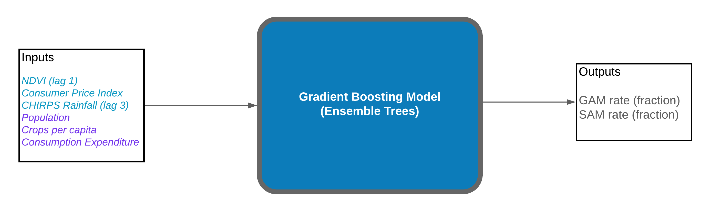
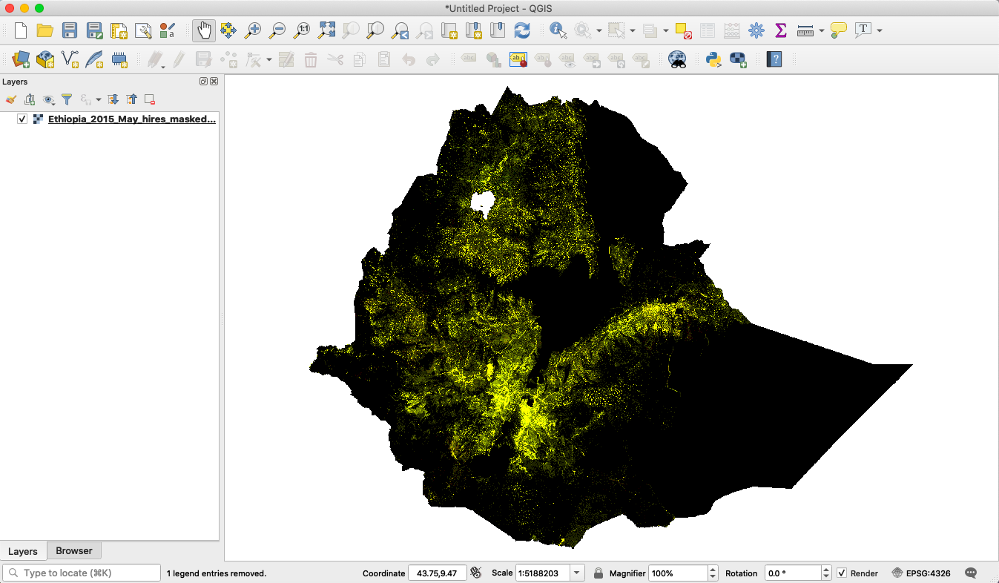

# Malnutrition Model

The malnutrition model was developed to predict the monthly malnutrition for Global Acute Malnutrition (GAM) and Severe Acute Malnutrition (SAM). Having these predictions enables more timely and efficient intervention efforts to reduce the prevalence of malnutrition in countries such as South Sudan and Ethiopia. According to World Health Organization (WHO) guideline, GAM and SAM are defined as weight-for-height z-score below -2, and weight-for-height z-score below -3 for children under the age of 5, respectively. By this definition, GAM includes all categories of malnutrition.

The model ingests the input values, and predicts the malnutrition rates of GAM and SAM for the next time point (e.g., next month), and converting that to number of cases. Please note it does not provide forecasting based on previous values of malnutrition rates in a time series, therefore this is not a forecast model.

## The Data

The input data used, covering the period 2011-2018, to train this model came from different sources as listed below.* The monthly CHIRPS and NDVI data were obtained from the [Early Warning eXplorer](https://earlywarning.usgs.gov/fews/ewx/index.html?region=ea-af) app hosted by Climate Hazards Group at UC Santa Barbara.
* Monthly  Consumer Price Index (2011-2018), a metric that reflects inflation,  is downloaded from [CLiMIS](http://climis-southsudan.org/dashboard) database.
* Yearly maize production [data](https://data.kimetrica.com/dataset/fecfeff6-32af-44fb-98ae-23fd875b7d28/resource/e927fb8d-9f38-4683-9da9-76509b4d3855) from the DSSAT model - the maize production was estimated with low rainfall and nitrogen fertilizer.
* Yearly Population estimate came from Kimetrica's population model.
* Consumption expenditure currently comes from a static raster file from the output of the house economic model (this might change in the future). It currently has no time dimension.

We trained the model using SMART survey data, which provides the ground truth labels for South Sudan (2014-2018) and Ethiopia (2007-2018).

## Input variables

* NDVI_lag1: NDVI data with a time lag of 1 month.
* CHIRPS(mm)_lag3: CHIRPS data with a time lag of 3 months (the time lag was chosen based on reference literature).
* CPI: Consumer Price Index.
* crop_per_capita: A ratio defined as kg of maize in admin2 divided by the population in that administrative boundary.
* Population: Total population based on a given administrative level (e.g. total population of a county).
* Month: Month variable formatted as one hot encoded variable.
* med_exp: Median consumption expenditure currently comes from a static raster file from the output of the house economic model (this might change in the future). It currently has no time dimension.

## Data preprocessing

The script `data_cleaning.py` was designed to clean and compile the raw data from the various sources, and organize them into one dataframe suitable for model training. 

Before training, the numeric variables such as crop per capita, medium expenditure, CHIRPS and NDVI are normalized to 0 mean and standard deviation of 1, and that Scaler object is saved for inference.

For inference post training, a dataset is gathered based on the given input values of `time`, `country-level `, `rainfall-scenario`,`rainfall-scenario-geography`, and `rainfall-scenario-time`. The data is then standardized before the model makes an inference on it.

## Building the model

<div align='center'><fig><figcaption>Fig.1. The general workflow of the malnutrition model. </figcaption></div>
<br>
For building the predictive model, a Gradient Boosting Machine (GBM) regression model was used. GBM model is composed of an ensemble of decision trees and works well with nonlinear data; it learns iteratively based on the error of the previous tree and places greater weight on samples with a bigger error value. 

Two models are trained on the same input variables for the target variables of GAM and SAM, and the hyperparameters are optimized using RandomSearch and cross validation. The model is chosen based on having the best cross validation metric. The training and test sets were organized as follows,

* South Sudan: training dataset for time points < 2018; validation dataset for time points >= 2018. 
* Ethiopia:  training dataset for time points < 2014; validation dataset for time points >= 2014. 

The r<sup>2</sup> values of GAM and SAM predictions on validation dataset were 0.3826 and 0.5780, respectively.
When making prediction on new data (inference), the model returns the predicted malnutrition rate on the 
county (Admin2) level. The number of malnutrition cases is subsequently calculated using the corresponding population data for people under the age of 5.

## Using the model (inference)

When using the pretrained model for inference, the input data needs to be in a tabular format (e.g. import from .csv file) with these columns headings (one hot encoding for the months in alphabetical order):  [`NDVI_lag1`, `Population`, `CPI`, `crop_per_capita`, `CHIRPS(mm)_lag3`, `med_exp`, `Apr`,  `Aug`, `Dec`, `Feb`, `Jan`, `Jul`, `Jun`, `Mar`, `May`, `Nov`, `Oct`, `Sep`, `Month`, `Year`,  `Time`], where the last three variables are there for output visualization and they are not used in the inference prediction. 

Note that before prediction, the scaler object from training is required to standardize the continuous variables `NDVI_lag1`, `Population`, `CPI`, `crop_per_capita`, `CHIRPS(mm)_lag3`, `med_exp` to 0 mean with standard deviation of 1.

All of the data wrangling steps are executed via the Luigi tasks in `tasks.py`.

## Outputs of the model

The monthly outputs of the malnutrition model from `MalnutInference` and `MalnutritionInferenceGeoJSON` reflect scenario parameters as defined in `GlobalParameters` class from `utils/scenario_tasks/functions/ScenarioDefinition.py`. The model currently returns monthly output in various formats of `.csv`, `.tiff` (raster), and `.geojson` for user-specified time range and geography. If the user wants tabular format of the malnutrition prediction aggregated on the admin2 level, the task for that is `MalnutInference` which will return a `.csv` file, and the task `MalnutritionInferenceGeoJSON` returns a `.geojson` file which contains geospatial coordinates. For hi-res raster of the malnutrition cases (1km^2 grid), the task to use is `HiResRasterMasked`.

An example snippet of the output for `MalnutritionInferenceGeoJSON` is shown below. The `.geojson` file can be opened as shapefiles in QGIS or as geopandas Dataframe in Python.

```
{
"type": "FeatureCollection",
"crs": { "type": "name", "properties": { "name": "urn:ogc:def:crs:OGC:1.3:CRS84" } },
"features": [
{ "type": "Feature", "properties": { "gam_rate": 0.14481504841489326, "sam_rate": 0.015567234132331553, "gam_number": 3504, "sam_number": 376, "gam_scenario": 3504, "sam_scenario": 376, "gam_rate_scenario": 0.14481504841489326, "sam_rate_scenario": 0.015567234132331553, "admin1": "Central Equatoria", "admin2": "Morobo", "country": "South Sudan", "Month": "May", "Year": 2018, "start": "2018-05-01", "end": "2018-06-01", "precipitation(mm)": 34.14864, "precipitation(mm)_scenario": 42.458301544189453, "rainfall_scenario": "high" }, "geometry": { "type": "Polygon", "coordinates": [ [ [ 30.557781290000037, 3.628754622000031 ], [ 30.560611415000039, 3.633943122000062 ], [ 30.560847165000041, 3.638188247000073 ], [ 30.566271540000059, 3.640074997000056 ], [ 30.568394165000029, 3.641961747000039 ], [ 30.570045040000025, 3.645027622000043 ], ...]] }}}
```

For raster output from tasks `HiResRasterMasked`, it contains two bands, one for GAM cases and one for SAM cases (baseline condition). It currently does not have the bands for cases based on rainfall scenario to keep the files lightweight. The raster files can be further processed using the Rasterio package in Python.
<div align='center'><fig><figcaption>Fig.2. An example raster for a one-month GAM prediction for Ethiopia. It has two raster bands - band 1 for GAM cases and band 2 for SAM cases. </figcaption></div>
<br>


## Quickstart code

To run a Luigi task in a local environment, make sure the PYTHONPATH has been set to the right directories. It's recommended to run this inside Docker container built with Kimetrica's pre-defined requirements and dependencies (see instructions [here](https://gitlab.com/kimetrica/darpa/darpa)). Once the system is setup, in the terminal enter the Darpa root directory, execute `luigi --module <file_name> <task_name> --local-scheduler`, this will trigger the task with the default `GlobalParameters` which corresponds to **South Sudan**. For example, if the user wants the geojson file as the output for malnutrition prediction, run `luigi --module models.malnutrition_model.tasks models.malnutrition_model.tasks.MalnutritionInferenceGeoJSON --local-scheduler` and the `.json` file will be in the appropriate output folder. 
If the user wishes to override the default `GlobalParameters` values such as the variable `time`, specify the value using command-line flag. For example, to run the model pipeline for time interval of 
January - February in 2017 with high rainfall scenario, specify the command this way: 
```bash
luigi --module models.malnutrition_model.tasks models.malnutrition_model.tasks.MalnutritionInferenceGeoJSON \
--time 2017-01-01-2017-03-01 --rainfall-scenario high --local-scheduler
```
The `time` object dates are non-inclusive, meaning in this case it won't include the month of March.

Currently, the following example command can trigger the prediction output file for **Ethiopia**, 
```bash
luigi --module models.malnutrition_model.tasks models.malnutrition_model.tasks.MalnutritionInferenceGeoJSON \
--time 2015-01-01-2015-06-01 --rainfall-scenario-time 2015-05-01-2015-05-10 --country-level Ethiopia \
--rainfall-scenario high --local-scheduler
```

## Constraints

The complete input data available for Ethiopia is in the time window of Jan, 2007 - Apr, 2019. For South Sudan, the data is avaialable
from June 2011 - Apr, 2019. Currently, it can only perform inferences for South Sudan and Ethiopia.

### reference
[1]Ikeda, T., Behera, S.K., Morioka, Y. et al. Seasonally lagged effects of climatic factors on malaria incidence in South Africa. Sci Rep 7, 2458 (2017). https://doi.org/10.1038/s41598-017-02680-6
