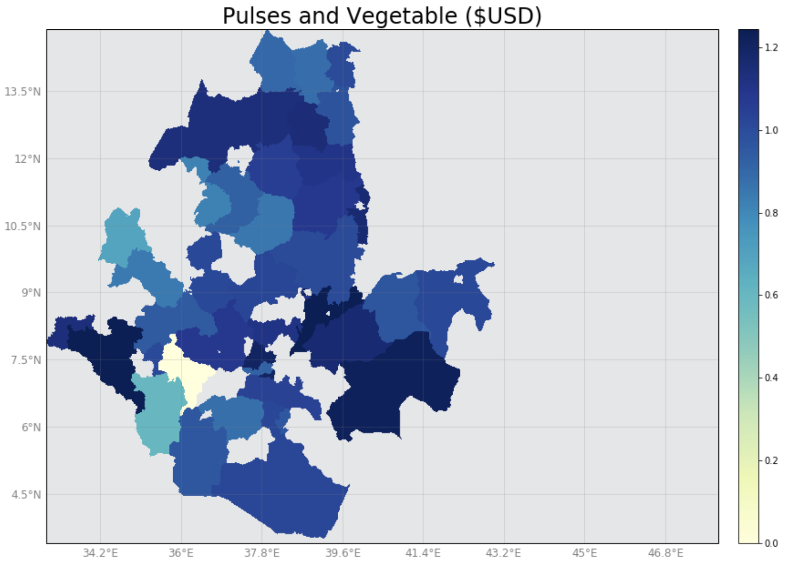
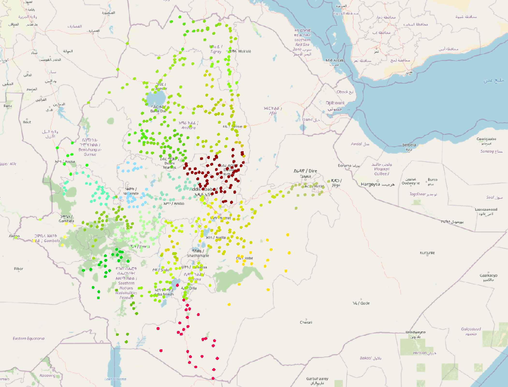
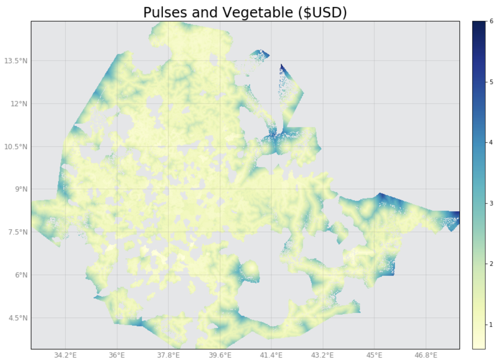

# Market Price Model
## 1. Overview
The Market Price Model predicts monthly prices of twelve agricultural commodities at the administrative zone level(admin2), in Ethiopia and the state level (admin1) in South Sudan. The model uses rainfall, fuel prices, historical commodity price data, number of fatalities, and crop production as input variables.
To predict the prices the model uses a Fixed Effects regression method which helps to capture unobserved variation in time-invariant variables.
For Ethiopia, the model predicts prices at main market locations in the cities and uses those market price predictions to project price estimates at a high-resolution level (pixels) to the areas with a population. 


## 2. Input Data
The market price model currently uses the following explanatory variables:
- South Sudan:
    - The price of petrol -- source: [CLiMIS South Sudan](http://climis-southsudan.org/markets)
    - Net weight of crop production in the state in the previous year -- source: [CLiMIS South Sudan](http://climis-southsudan.org/crop)
    - Number of fatalities from violent conflict in the previous month -- source: [ACLED](https://www.acleddata.com/curated-data-files/)
    - Total rainfall in the previous month -- source: [Climate Hazards Group InfraRed Precipitation with Station data (CHIRPS)](http://chg.geog.ucsb.edu/data/chirps/)
    - Commodity prices in the previous month at admin1 level -- source: [CLiMIS South Sudan](https://data.kimetrica.com/dataset/023b0560-4058-49a4-8317-7b3535dbd4e0/resource/25abce10-9bd2-4cca-bfe5-e538829fbe66)
        -  The commodities are `beans`; `groundnuts`; `maize`; `meat`; `milk`; `okra`; `rice`; `sorghum`; `sugar`; `vegetable oil`; and `wheat`. These prices are available from January 2013 through December 2017.


- Ethiopia:
    - The price of diesel -- source: [CSA Ethiopia](https://data.kimetrica.com/dataset/ddf2f709-c5a7-40c0-88c6-04df9c26bca3/resource/bdaa9425-0b7c-43e9-b4b7-e7564971db1f)
    - Total rainfall in the previous month -- source: [Climate Hazards Group InfraRed Precipitation with Station data (CHIRPS)](http://chg.geog.ucsb.edu/data/chirps/)
    - Number of fatalities from violent conflict in the previous month -- source: [ACLED](https://www.acleddata.com/curated-data-files/)
    - Net weight of crop production in the state in the previous year for each commodity -- source: [CSA Ethiopia](https://data.kimetrica.com/dataset/9ffe6d58-f60f-4ece-ac4c-79ad9c52b144/resource/05034af2-1894-49c3-8bfe-7b10e1406079)
    - Commodity prices in the previous month at admin2 level -- source: [CSA Ethiopia Sudan](https://data.kimetrica.com/dataset/d6e341d4-e68e-457a-b3af-eaf41d66f20f/resource/41370776-965a-4d64-805b-9fd955881681)  
        - The commodities are `maize`; `beef`; `milk`; `millet`; `teff`; `rice`; `beans`; `sugar`; `fuit`; `ground nuts` and `wheat`. These prices are available from July 2012 to June 2015 and from July 2017 to June 2018.


#### Data Cleaning
All data preprocessing of data occurs in the [data_cleaning.py](https://gitlab.com/kimetrica/darpa/darpa/-/blob/master/models/market_price_model/data_cleaning.py) script and can be performed en masse by calling the `WriteCleanedPriceModelData` task.

* Prices for food commodities and petrol are standardized to 2011 USD/kg using the units of measure and exchange rates for the country of choice.
* Rainfall is downloaded as a raster with 3 arcminute resolution and aggregated to the admin level by taking the mean value occurring within the admin boundaries.


## 3. Model
### Fixed Effects Regression

To capture both spatial and temporal availability within one model, we treat the model as panel data -- observations of different regions over multiple time periods -- and employ a Fixed Effects(FE) regression.
The FE used for estimation of the model is specified as follows:


```math
p_{it} = \gamma. p_{it-1} + \beta_1. pfuel_{it} + \beta_2. fatalities_{it-1} +  \beta_3. crop_{it} +  \beta_4. rainfall_{it} + \alpha_i + \epsilon_{it}
```

where $`p_{it}`$ is commodity price in region $`i`$ (Zone for Ethiopia and State for South Sudan) at time $`t`$ (month-year). 

$`p_{it-1}`$ is the price in previous month

$`pfuel_{it}`$ is the price of fuel in the region $`i`$ at time $`t`$

$`fatalities_{it-1}`$ is the number of fatalities in the previous month 

$`crop_{it}`$ is the level of crop production 

$`rainfall_{it}`$ is the level of precipitation in month $`t`$ and region $`i`$

$`\alpha_i`$ is the region-specific fixed effect which captures time-invariant characteristics of region $`i`$. Conceptually, this is equivalent to adding a dummy variable for each region.

<br/><br/>
An advantage of the Fixed Effects Estimator is that it allows us to fit a single model for an arbitrary number of geographic locations over an arbitrary amount of time period. 
Additionally, it allows for easy interpretation of the effects of the covariates of interest and the uncertainty surrounding the estimated parameters. 
The model does, however, imply that the parameterization of the predictors of market prices is time-invariant (i.e. that what determines the price of a commodity today will determine the price of that same commodity tomorrow). 
After estimating the coefficients of the model in [tasks.py](https://gitlab.com/kimetrica/darpa/darpa/-/blob/master/models/market_price_model/tasks.py), 
the model is used to predict prices for `time` and `rainfall-scenario` given to the model by a user. 

The market price model predicts monthly prices (in 2011 USD/kg) for twelve commodities where is each commodity is assigned to one of the following commodity groups using [WFP guidelines](https://documents.wfp.org/stellent/groups/public/documents/manual_guide_proced/wfp197216.pdf?_ga=2.53698400.917708111.1555622583-661089132.1555622583):
1) Meat, 2) Bread and Cereal, 3) Milk, Cheese, Egg, 4) Sugar, Jam, Honey, Chocolate and Candy, 5) Pulses and Vegetable 6) Fruit (Ethiopia) or Oils and fats (South Sudan). 
 
### Model Output
The commodity group prices are used to create outputs. The model generates two types of output: 1) `.geojson` files that show prices for each commodity group at the aggregate level of admin1 or admin2 depending on parameter selection. Six files associated with six commodity group are created for each month.
2) `.tiff` files, also known as raster files. Each raster file has six bands associated with the six commodity groups. `tiff` files show high-resolution price data for a 2km<sup>2</sup> pixel with a population greater than zero.


## 4. Quickstart code 
As a simple example, the model can run for South Sudan with the default dates, 2017-01 to 2017-06, and the default option of a normal rainfall scenario using the following terminal command:
```bash
 luigi --module models.market_price_model.tasks models.market_price_model.tasks.PriceToGeoJSON --local-scheduler
```
<br/><br/>
This is another example for Ethiopia from 2018-01 to 2018-06 and a low rainfall scenario: 
```bash
luigi --module models.market_price_model.tasks models.market_price_model.tasks.PriceToGeoJSON \
--country-level Ethiopia --time 2018-01-01-2018-06-01 --rainfall-scenario low --local-scheduler
```

<br/><br/>

*Figure 1: Prices of Pulses and Vegetable at Admin2 level in February 2018*



<br/><br/>
For Ethiopia, the model can take the locations of major markets and generate an output at the locations using the following command:

```bash
luigi --module models.market_price_model.tasks models.market_price_model.tasks.PricesGeotiff \
--country-level Ethiopia --time 2018-01-01-2018-06-01 --rainfall-scenario low --local-scheduler
```
<br/><br/>

*Figure 2: Cereal and Bread prices at major market locations in May 2018*



<br/><br/>

To generate a single high-resolution raster file as the output with prices for six commodity group we can run the following command:
```bash
luigi --module models.market_price_model.tasks models.market_price_model.tasks.MergePriceAccessbilityRaster \
--country-level Ethiopia --time 2018-01-01-2018-06-01 --local-scheduler
```
<br/><br/>

*Figure 3: Prices of Pulses and Vegetable group at a high-resolution level in February 2018*


<br/><br/>