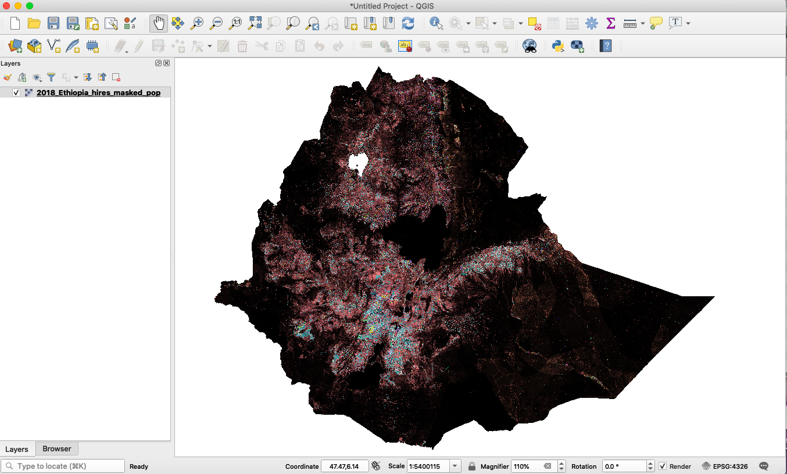

## Population model  

The population model serves as an ancillary tool to distribute, disaggregate yearly population projections onto a geospatial representation. Occasionally, the output of this model is required as an independent variable for downstream models.

#### South Sudan
The population model used for **South Sudan** is grounded on a method called Component Analysis (or Component Method) [1](https://planningtank.com/planning-techniques/population-projection-methods), which takes into account Crude Birth Rates (CBR), Crude Death Rates (CDR), and migration rates (inmigration and outmigration). Any of these rates may change in a linear or non-linear fashion.

pop<sub>t</sub> = pop<sub>t-1</sub> + pop<sub>t-1</sub> * CBR<sub>t</sub>*(1 + birth_rate_fct) - pop<sub>t-1</sub> * CDR<sub>t</sub> *(1 + death_rate_fct) + Immigration<sub>t</sub>- Outmigration<sub>t</sub>

In this equaiton, death/birth_rate fct is applied to the nominal growth rates. It is used for sensitivity studies of changes in the growth rate. For example, if one uses a birth_rate_fct of 0.1 this will boost the nominal growth rates by 10%. These variables are put in place to account for any possible bias in the census data.

#### Ethiopia
The dataset for **Ethiopia** have population projection values from UNFPA (United Nations Population Funds), and does not have growth rate values (birth, death rates).

## The Data
In this model, all of the projected values are based on the last census conducted in South Sudan in 2008 before its independence from Sudan in 2011. The census was carried out by the Sudanese government, and there's speculation that numbers for the regions within South Sudan were underestimated for political reason at the time. 

For Ethiopia, the population projected values from UNFPA are available for 2000-2020.

Other data such as shapefiles for geospatial boundaries are also utilized for rasterizing the output. Here's the list of raw data used for this model along with the source.

- South Sudan   
    -  shapefiles for [County](https://data.kimetrica.com/dataset/79e631b6-86f2-4fc8-8054-31c17eac1e3f/resource/210558e2-d70f-4762-b24b-6be2992d1e41) (admin2) and [Payam](https://data.kimetrica.com/dataset/79e631b6-86f2-4fc8-8054-31c17eac1e3f/resource/39a7af45-d929-4475-851d-8b0d763b7f7c) (admin3)
    - Population density [raster](https://data.kimetrica.com/dataset/83a07464-6aa1-4611-8e51-d2e04c4a7b97/resource/146eafe7-28fe-4ccd-8daa-dc95e5252389) from LandScan
    - Census data csv [file](https://data.kimetrica.com/dataset/f6544ffc-3f7f-4170-8520-e1b75c657f6e/resource/73aeb9fb-ae0f-4a1d-88e0-4299f6eb9637)

- Ethiopia
    - shapefiles for [Zone](https://data.kimetrica.com/dataset/d07b30c6-4909-43fa-914b-b3b435bef314/resource/d4804e8a-5146-48cd-8a36-557f981b073c) (admin2) and [Woreda](https://data.kimetrica.com/dataset/d8292b7b-c937-4e81-bc96-796f2d78f339/resource/2c8a0376-7d93-48d8-b2a5-3c10f1d3eb1a)
    - Population density [raster](https://data.kimetrica.com/dataset/11bd6b1e-6939-4f00-839d-fdff1a470dd1/resource/fef4be94-0f26-4861-bc75-7e7c1927af24) from LandScan
    - Census data csv [file](https://data.kimetrica.com/dataset/f6544ffc-3f7f-4170-8520-e1b75c657f6e/resource/b3a49113-780c-481c-8bed-eae7e2bf7e80)

## Data preprocessing

Raw data from difference sources were pooled together for the population projection values, and the adminstrative names have all been normalized by the Data collection team at Kimetrica.

## Using the model

The population model is not a machine learning model. It works by distributing projected or census population values into adminstrative boundaries or high resolution raster (1km pixel resolution). 

To generate the high resolution raster, the model leverages the LandScan population density raster which has density values calculated based on admin2 level. Using the density raster pixels, the given population value in a model run can be distributed spatially onto the map.

In order to run the population model for different countries, the user needs to specify input argument `country-level`,`time`, as well as `geography`. Other parameters refer to rain scenario and does not affect the this model but it's nice to define them to make sure they are consistent with other models that runs on those parameters.

## Outputs of the model

Currently, the `.tiff`  and `.geojson` outputs contain population estimation for different demographic groups, please see `population_model.yml` for more information. If tabular format is required, then task `EstimatePopulation` can be used to return a `.csv` file, but it will not have the actual geospatial coordinates such as polygon objects. 

The yearly projected population is at the county level (admin2) because all of the other models operate at the same administrative level. The output from this model can be rasterized into a `.tiff` file where it takes the population density raster from LandScan and distribute the admin2 population values to a 1km<sup>2</sup> resolution. The task to run this is `HiResPopRasterMasked`.

An example output of `RasterizedPopGeojson` is shown below. It contains key-value pairs for the different demographic groups (see `population_model.yml`). Please note this format is quite large, and it is recommended to use the raster output from `HiResPopRasterMasked` instead (see Fig.1)
```
 {"type": "Feature", "geometry": {"type": "Polygon", "coordinates": [[[38.672262668148974, 13.512720413943356], [38.672262668148974, 13.504386209150328], [38.68059472484714, 13.504386209150328], [38.68059472484714, 13.512720413943356], [38.672262668148974, 13.512720413943356]]]}, "properties": {"population_btotl": 1014196.0}}...
 ```

<div align='center'><fig><figcaption>Fig.1. An example population raster for Ethiopia (displayed in QGIS). The raster consists of 23 bands total for the different demographic groups. </figcaption></div>
<br>

## Quickstart code

To run the population for South Sudan 2018, the command line is 

```bash
luigi --module models.population_model.tasks models.population_model.tasks.HiResPopRasterMasked \
--time 2018-04-01-2018-09-01 --local-scheduler
``` 

For Ethiopia, the command line is 

```bash
luigi --module models.population_model.tasks models.population_model.tasks.HiResPopRasterMasked \
--time 2018-04-01-2018-09-01 --country-level Ethiopia \
--local-scheduler
```

In general, the `rainfall-scenario-time` should fall within the interval specified by `time`.

In addition to tiff format, geoJSON files can be generated from the hi-resolution raster by the task `RasterizedPopGeojson`. For South Sudan, an example command is:
```bash
luigi --module models.population_model.tasks models.population_model.tasks.RasterizedPopGeojson \
--time 2018-04-01-2018-09-01 --local-scheduler
``` 

And for Ethiopia, the command is:
```bash
 luigi --module models.population_model.tasks models.population_model.tasks.RasterizedPopGeojson \
 --time 2018-04-01-2018-09-01 --country-level Ethiopia --local-scheduler
 ```

## Constraints

The model currently supports output corresponding to admin2 and admin3 levels.

Population output values of South Sudan are available from 2008 onward; for Ethiopia the population projected values from UNFPA are available for 2000-2020.

## Future work

* The density raster file for Sudan is now available after Lisa Jordan had processed the raw LandScan raster data, and it can be found at this CKAN [link](https://data.kimetrica.com/dataset/raster-input-data-for-sudan/resource/2725885e-b99f-4841-950b-26586ceeb990).
* Other density raster files are available for [Ethiopia](https://data.kimetrica.com/dataset/ethiopia-building-detection-data/resource/b98b7694-4b9e-4835-bfb1-ed9d59dc4763) and [South Sudan](https://data.kimetrica.com/dataset/raster-data/resource/d35f9115-f640-445e-98db-3e5a1ab8140b). These files are derived from the output of the building-detection [model](https://gitlab.com/kimetrica/kimetrica-wip-projects/jenny-yu/sentinel_bldg/-/tree/master/), and Lisa processed the outputs to normalize the pixels to population percentage values.
