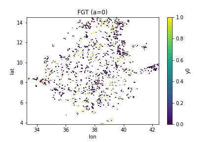
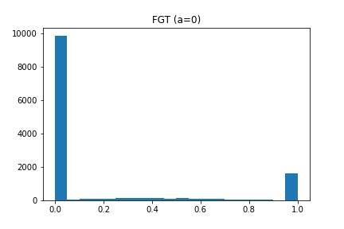
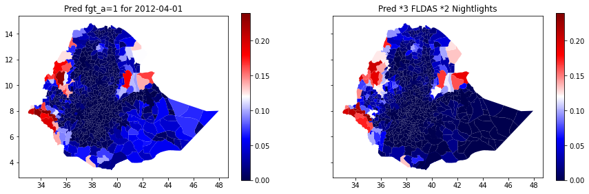

# Poverty Model
The poverty model estimates poverty levels, currently only in Ethiopia at the fourth administrative level. It uses household consumption survey data and remote sensing data for training, and can make poverty predictions for any month in 2011 to 2017. 

## The Data
### Target
In Ethiopia, the Central Statistical Agency’s “Household Consumption Expenditure Survey” (HCE) is conducted every five years, taking one full year to collect data nationwide. The last two surveys, 2011 and 2016, provide the basis for ground-truth poverty estimates. Both surveys are granular to the fourth administrative level. 

The "Foster-Greer-Thorbecke" (FGT) index was used as the poverty metric, which is indicated in the following equation:

```math
y_i = \Big(\frac{min(z_t - e_i, 0)}{z_t}\Big)^a , w_i
```

where subscript *i* refers to a sample, *z<sub>t</sub>* refers to the poverty line at time *t* in the units of *e*, the real total consumption expenditure per adult. *z<sub>2011</sub>* was 3781 and *z<sub>2016</sub>* was 7436 in the local currency. Here, *α* transitions the response from binary (*α*=0) to continuous (*α*>0). The higher the value of *α*, the greater the weight placed on the poorest individuals; when *α* is 0, all individuals below the poverty line are weighted roughly the same. *y<sub>i</sub>* is weighted by its weight *w<sub>i</sub>* to get the population estimate.  

Weighted by population and projected onto a map, we have about 13000 pixel level estimates of y. 
<div <fig>
<br>
Few pixels included a mix of FGT(a=0) scores; nearly all average values were 0 or 1 with a majority of 0s (not poor). 
<div <fig>
<br>

### Predictors
#### Land Cover (esacci)
Land cover classification provides a measure of economic well-being through the identification of productive land, whether for agricultural, industrial, residential, or communal use. The data used here is from the European Space Agency Climate Change Initiative, which classifies land into 36 types. It has a 300m resolution and is available annually. 

#### Agro-climatology (fldas)
In resource-poor areas, a major contributor to household real income is local agricultural production. Thus, agro-climatology can be a strong indicator of food production and corollary cost reduction. The data used here is from FEWS-NET Land Data Assimilation System, which includes eight land surface variables like evapotranspiration, precipitation, soil moisture at various depths, and near surface air temperature. The FLDAS is available at 0.1 degree (≈11km) resolution and on a monthly basis.

#### Night lights (svdnb)
Nighttime lights act as a proxy indicator for the affluence and industrialization of a region and is often used in poverty modeling. The data used here is the VIIRS day/night band, giving nighttime lights at 500m resolution with a 1 month repeat.

#### Population (landscan)
Population distribution and demographics are critical to understanding poverty, in addition to being the obvious denominator of the poverty rate calculation. The data used here is the LANDSCAN data produced by Population Explorer at ORNL. It is at a 1km resolution and is available annually. 


## Training
Training is done on deep neural networks. Hyper parameter tuning was conducted separately on 100 random sets of parameter values, including the those for the learning rate, dropout rate, number of hidden layers, neurons per layer, batch size and type of optimizer (see notebooks/hyperparameter tuning.ipynb). The best hyper parameters were encoded back in, so the full run will conduct model training again, but will not do any hyper parameter tuning.


## Run
Note that the time frame has been constrained to be within 2011 – 2017 due to the limited availability of predictor data. Any years before 2011 will default to 2011 and any years after 2017 will default to 2017. Run a task like the following (see also notebooks/Poverty model visualizations.ipynb): 

```
import luigi
from models.poverty_model.model import Output

task = Output.from_str_params({
    "fgt_a": 0,
    "threshold": 0.8,
    "predict_period": "2017-12-01"
})
```
In the command line, run:
```
luigi --module models.poverty_model.model models.poverty_model.model.Output --fgt-a 0 --threshold 0.8 --predict-period "2017-12-01" --local-scheduler
```
Parameters that can be adjusted include:

* `fgt_a`: non-negative float (default 1) indicating the α value for FGT calculation

* `threshold`: float between 0 and 1 (default 0.5) indicating the predicted score of the above poverty-line class, with scores below this threshold getting a non-zero (poverty) prediction

* `predict_period`: date string (default "2017-12-01") indicating the date to be predicted. Note that predictions are at the month level, so every day of the same month will have the same prediction.

* `seed`: integer (default 8888) indicating the seed used for training and for mapping survey responses to pixels


## What-if Scenarios
What-if scenarios are currently available for `fldas` and `svdnb` variables. These variables can be adjusted by the given rate. To inflate `fldas` and `svdnb` each by a factor of 2, run:
```
luigi --module models.poverty_model.model models.poverty_model.model.Output --fgt-a 0 --threshold 0.8 --predict-period "2017-12-01" --fldas 2 --svdnb 2 --local-scheduler
```


## Results
The following maps show the poverty predictions aggregated to the fourth administrative level (*α*=0). The map on the left uses the original predictor values, while the map on the right uses `fldas` and `svdnb` values that have been each been inflated by a factor of 2. 

<div <fig>