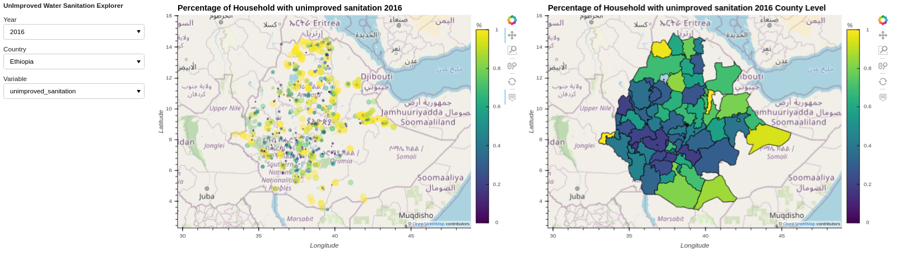
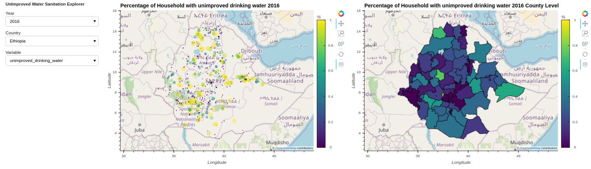
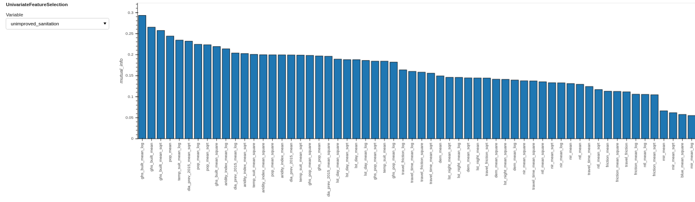
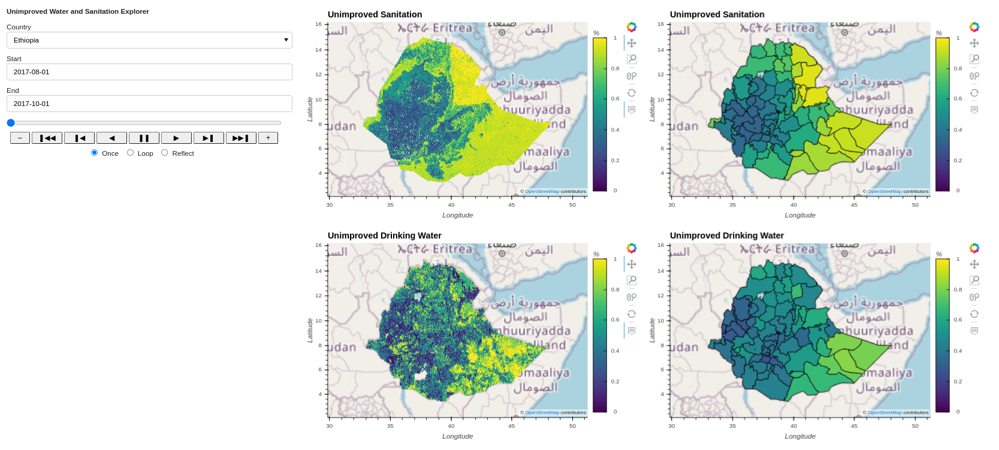

# Water and Sanitation Model

Access to improved sanitation and source of drinking water is essential in reducing cases of stunting and diarrhea. 
Other benefits of access to improved sources of water and sanitation are: time saving, school attendance, and 
reduction in violence and stress.  According to WHO, 2.2 billion people lack access to safely managed drinking water 
services and 4.2 billion people lack safely managed sanitation services.

Water and sanitation data is reported at predefined geographic areas, mostly admin level 2. 
Heterogeneity within the geographic region is typically hidden from the policy makers. 
The objective of the water and sanitation model is to predict the percentage of households 
that have access to unimproved sanitation and source of drinking water at pixel level. 
Our hypothesis is that areas where people don't have access to improved sanitation and 
source of drinking water share spectral traits that make them distinguishable from areas with 
improved sanitation and source of drinking water when viewed from above.


## Input datasets
### Target variables
#### Unimproved sanitation
We used  WHO/UNICEF Joint Monitoring Programme for Water Supply, Sanitation and Hygiene (JMP) standards to calculate 
percentage of households with unimproved sanitation from LSMS survey. JMP defines improved 
sanitation facilities as those designed to hygienically separate excreta from human contact and not
 shared with other households. They include: flush/pour flush to piped sewer system/septic tank/pit latrine, 
 ventilated improved pit latrine, and pit latrine with slab.
 
<div align='center'><fig><figcaption>Fig.1. Unimproved sanitation target variable. </figcaption></div>
<br>


#### Unimproved source of drinking water
We used JMP standards to calculate the percentage of households with an unimproved source of drinking 
water. According to JMP, improved drinking water sources are those which, by nature of their design and 
construction, have the potential to deliver safe water. They include: tap water in the dwelling yard, 
tap water in public standposts, boreholes/tubewells, protected wells and springs, rainwater, packaged 
water and delivered water.

<div align='center'><fig><figcaption>Fig.2. Unimproved source of drinking water target variable. </figcaption></div>
<br>

### Possible predictors
* Travel time from Kimetrica's population model
* Population from Kimetrica's accessibility model
* Aridity index
* Monthly night time light
* Yearly land cover, 
* Monthly MODIS climate variables
* Topographic data.


## Feature Engineering and Selection
Additional features were created by getting the square, square root and the log of the numeric possible predictors. 
The original predictors and additional features were compared by estimating mutual information 
using sklearn between these features and the target. The feature with the highest value was selected. 

<div align='center'><fig><figcaption>Fig.3. Univariate feature selection. </figcaption></div>
<br>

To select the final predictors, a number of feature selection methods we used. 
The method used include: lasso regression, random forest, linear regression, and recursive 
feature elimination with random forest estimator. The methods used outputs coefficient or feature 
importance which were scaled to be between 0 and 1. After scaling they were aggregated using mean 
and used to select final  predictors. 

## Building the model
[StratifiedShuffleSplit](https://scikit-learn.org/stable/modules/generated/sklearn.model_selection.StratifiedShuffleSplit.html)
was used to split the data into train and test sets. 
This method was used to ensure we have the same distribution of target variables in 
both train and test sets.  The estimators that we evaluated are: [Random forest regression](https://scikit-learn.org/stable/modules/generated/sklearn.ensemble.RandomForestRegressor.html), 
[Extra tree regressor](https://scikit-learn.org/stable/modules/generated/sklearn.ensemble.ExtraTreesRegressor.html), 
[linear regression](https://scikit-learn.org/stable/modules/generated/sklearn.linear_model.LinearRegression.html) and 
[Histogram-based Gradient Boosting Regression Tree](https://scikit-learn.org/stable/modules/generated/sklearn.ensemble.HistGradientBoostingRegressor.html). 
For each estimator, we created parameters search space and used GridSearchCV to determine the best parameters. 
The estimators with the best parameters we used to make predictions on the test set. 
The estimator with highest r-squared was selected as the final model. 
Histogram-based Gradient Boosting Regression Tree outperformed other estimators with an r-squared of up to 0.7.

## Output of the model
We trained two models that predict proportions of households that have unimproved sanitation and source of 
drinking water at 1km spatial resolution and month time step.

The command to outputs unimproved sanitation and source of drinking water as netcdf files in Ethiopia:
```bash
luigi --module models.water_sanitation_model.tasks models.water_sanitation_model.tasks.PredictUnimprovedSanitation \
--country-level Ethiopia --travel-time-percent-change 0 --aridity-index-percent-change 0 \
--night-light-percent-change 0 --local-scheduler
```
The command to output unimproved sanitation as netcdf files in Ethiopia:
```bash
luigi --module models.water_sanitation_model.tasks models.water_sanitation_model.tasks.PredictUnimprovedToiletFacility \
--country-level Ethiopia --time 2017-08-01-2017-10-01 --aridity-index-percent-change 0 --local-scheduler
```
The command to output unimproved sanitation as raster files in Ethiopia:
```bash
luigi --module models.water_sanitation_model.tasks models.water_sanitation_model.tasks.UnimprovedSanitationRaster \
--country-level Ethiopia --time 2017-08-01-2017-10-01 --aridity-index-percent-change 0 --local-scheduler
```
The command to output unimproved sanitation as a geojson file in Ethiopia:
```bash
luigi --module models.water_sanitation_model.tasks models.water_sanitation_model.tasks.UnimprovedSanitationGeojson \
--country-level Ethiopia --time 2017-08-01-2017-10-01 --aridity-index-percent-change 0 --local-scheduler
```

The command to output unimproved source of drinking water as netcdf files in Ethiopia:
```bash
luigi --module models.water_sanitation_model.tasks models.water_sanitation_model.tasks.PredictUnimprovedDrinkingWater \
--country-level Ethiopia --time 2017-08-01-2017-10-01 --travel-time-percent-change 0 --aridity-index-percent-change 0 \
--night-light-percent-change 0 --local-scheduler
```
The command to output unimproved source of drinking water as raster files in Ethiopia:
```bash
luigi --module models.water_sanitation_model.tasks models.water_sanitation_model.tasks.UnimprovedDrinkingWaterRaster \
--country-level Ethiopia --time 2017-08-01-2017-10-01 --travel-time-percent-change 0 --aridity-index-percent-change 0 \
--night-light-percent-change 0 --local-scheduler
```
The command to output unimproved source of drinking water as a geojson file in Ethiopia:
```bash
luigi --module models.water_sanitation_model.tasks models.water_sanitation_model.tasks.UnimprovedDrinkingWaterGeojson \
--country-level Ethiopia --time 2017-08-01-2017-10-01  --travel-time-percent-change 0 --aridity-index-percent-change 0 \
--night-light-percent-change 0 --local-scheduler
```

<div align='center'><fig><figcaption>Fig.4. Proportion of households with unimproved sanitation and source of drinking water at pixel level and admin 2 level </figcaption></div>
<br>

